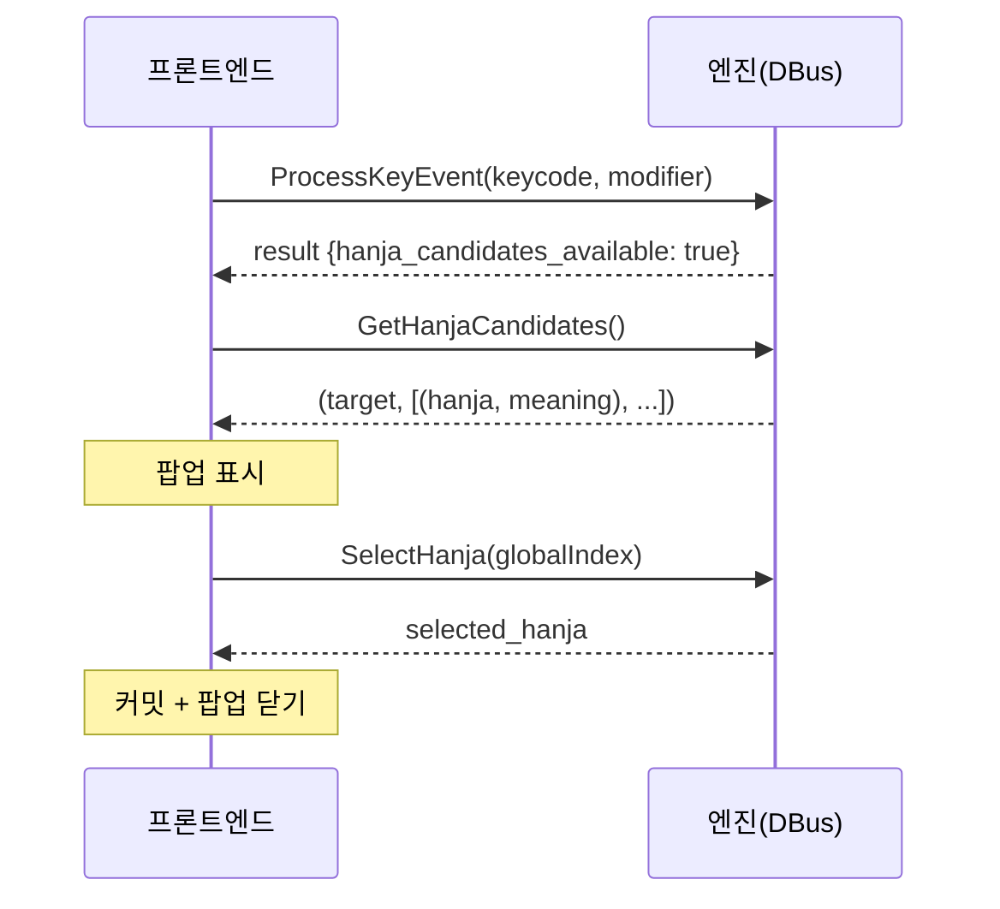
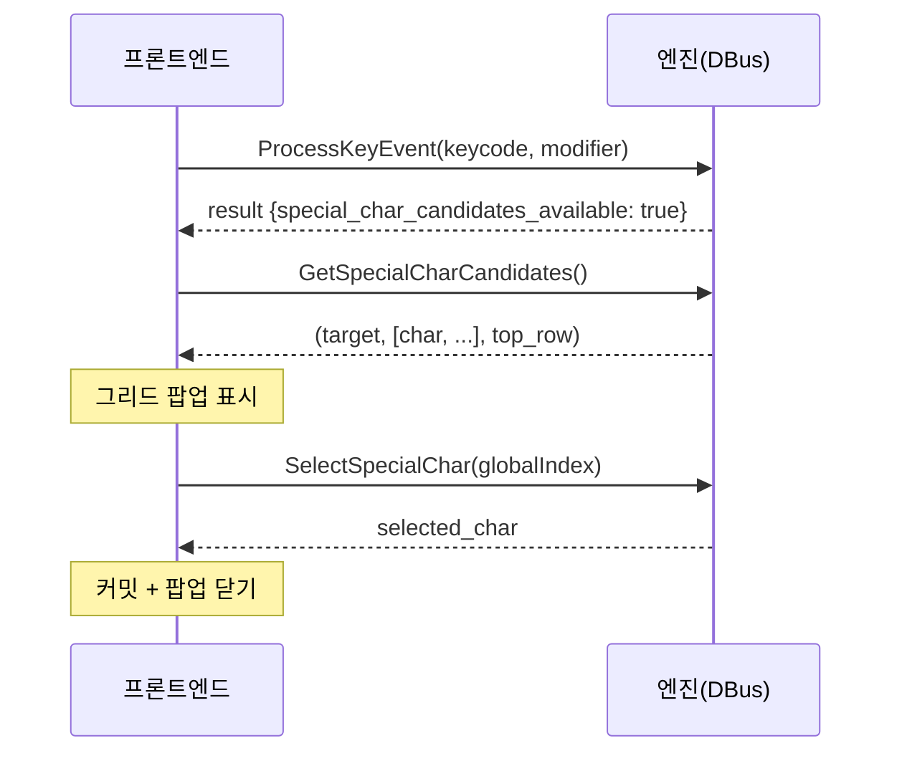
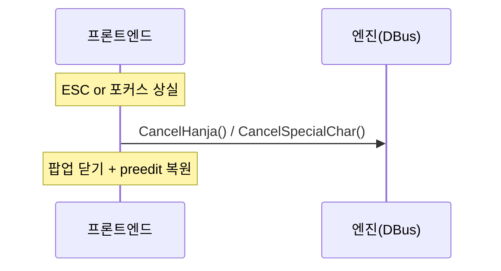

# UNIM 한자/특수문자 팝업 통합 설계서

> 이 문서는 모든 프론트엔드(GTK3/4, Qt5/6, XIM, Wayland, GNOME Shell)에서
> 한자 및 특수문자 팝업이 따라야 할 **공통 규격**을 정의합니다.
> 각 프론트엔드는 자체 렌더링 방식으로 이 규격을 구현합니다.

---

## 1. 아키텍처 개요

### 1.1 핵심 원칙: 모듈별 개별 팝업

각 프론트엔드가 **자체 in-process 팝업**을 렌더링합니다.
팝업 표시/선택 판단은 엔진 코어에서
(`InputResult.hanja_candidates_available` / `special_char_candidates_available`),
실제 UI는 프론트엔드가 담당합니다.

```
┌─────────────────┐      DBus      ┌────────────────┐
│  프론트엔드      │ ◄──────────────► │  unim-daemon    │
│  (GTK4 immodule) │  ProcessKey    │  (InputEngine)  │
│   ┌─────────┐   │  GetHanjaCand  │                 │
│   │ 팝업 UI │   │  SelectHanja   │  한자 사전      │
│   └─────────┘   │  CancelHanja   │  특수문자 테이블│
└─────────────────┘                └────────────────┘
```

### 1.2 프론트엔드별 렌더링 방식

Phase 7(팝업 중앙화) 이후 **렌더 주체는 두 곳뿐**이다 — `unim-popup-service`(GTK4)와
GNOME Shell 확장(St 위젯). 프런트엔드는 커서 좌표를 올려 보내기만 한다.

| 프론트엔드 | 렌더 주체 | 팝업 위치 전달 | 비고 |
|-----------|-----------|----------|------|
| **GTK3/GTK4** | popup-service | `set_cursor_location` 절대좌표 | 자체 팝업 위젯 없음 (gtk-common 은 DBus 클라이언트만) |
| **Qt5/Qt6** | popup-service | `cursorRectangle` 절대좌표 | 자체 팝업 클래스 없음 (qt-common 은 DBus 클라이언트만) |
| **XIM** | popup-service | XIC spot location | `pe_window.rs` 는 preedit 전용 |
| **Wayland** | popup-service | 커서 좌표 (DBus) | 백엔드 3종 자동 검출 (§8.4) |
| **GNOME Shell** | **확장 자체** (St.BoxLayout + Clutter.Actor) | `set_position(x, y)` | Mutter 가 layer-shell·input_popup 모두 미지원이라 유일한 예외 (§8.5) |

### 1.3 데이터 소스 (코어 공유)

- **한자 데이터**: `src/hangul/hanja.rs` — `include_str!("../data/hanja.txt")` 빌드 시 임베드
- **특수문자 데이터**: `src/special_chars/` (`mod.rs` + `data.rs`) — 초성(ㄱ~ㅎ) → 특수문자 정적 매핑

---

## 2. DBus 프로토콜 (프론트엔드 ↔ 엔진)

### 2.1 한자 변환 시퀀스



### 2.2 특수문자 변환 시퀀스



### 2.3 취소 시퀀스



### 2.4 DBus 메서드 정리

| 인터페이스 | 메서드 | 인자 | 반환 | 용도 |
|-----------|--------|------|------|------|
| `InputContext` | `GetHanjaCandidates` | — | `(s target, a(ss) candidates)` | 한자 후보 목록 |
| `InputContext` | `SelectHanja` | `(u index)` | `(s hanja)` | 한자 선택 → 커밋 |
| `InputContext` | `CancelHanja` | — | — | 한자 모드 취소 |
| `InputContext` | `GetSpecialCharCandidates` | — | `(s target, as chars, s top_row)` | 특수문자 후보 |
| `InputContext` | `SelectSpecialChar` | `(u index)` | `(s char)` | 특수문자 선택 |
| `InputContext` | `CancelSpecialChar` | — | — | 특수문자 모드 취소 |
| `InputContext` | `popup_change_page` | `(i direction)` | — | **마우스 ◀/▶용 페이지 이동** (0=Prev, 1=Next). 한자/특수문자/이모지 모든 팝업에서 동작, 단일 페이지면 no-op. (v3.1) |
| `InputContext` | `ToggleHanjaBookmark` | `(u index)` | `(u new_index, b bookmarked)` | 한자 즐겨찾기 토글. 결과는 `HanjaCandidatesReordered` 시그널로 일괄 통지. |
| `InputContext` | `TogglePopupExpand` | — | — | **마우스 ⊞/⊟용 한자 popup 확장 모드 토글** (v3.2). compact↔expanded 전환. popup-owner 라우팅 보정 (caller 와 popup_state 활성 context 가 다를 수 있음 → daemon 이 `resolve_popup_owner`로 자동 보정). 활성 한자 popup 이 없으면 no-op. |

### 2.5 DBus 시그널 정리

| 시그널 | 페이로드 | 용도 |
|--------|---------|------|
| `ShowHanjaPopup` | `(s target, a(ss) candidates, u top_row, i cursor_x, i cursor_y, u cursor_w, u cursor_h)` | 한자 팝업 표시 (활성화 트리거 + 커서 좌표) |
| `ShowSpecialPopup` | `(s target, as chars, s top_row, ...)` | 특수문자 팝업 표시 |
| `HidePopup` | — | 팝업 닫기 |
| `PopupNavigate` | `(u page, u total_pages, u selected, u rows, u cols, u sel_row, u sel_col)` | (legacy, v3.2 부터 PopupRender 와 dual-emit) 페이지/커서 변경. |
| `HanjaCandidatesReordered` | `(s target, as hanjas, as meanings, ab bookmarks, u new_cursor, u page, u sel_row, u sel_col, b bookmarked, b was_bookmarked)` | 한자 즐겨찾기 토글 후 재정렬·커서 점프. **`was_bookmarked`는 v3.1에서 추가**된 토글 직전 상태 — 프런트엔드는 `was_bookmarked && !bookmarked`일 때 cursor 셀에 flash(140ms #f9e2af)를 띄운다. |
| `PopupRender` (v3.2) | `(u kind, (s target, s header_text, s footer_text, s expand_text), (u rows, u cols, u sel_row, u sel_col, u current_page, u total_pages), (b show_footer, b expand_visible), a(ssu) cells, a(sb) col_headers, a(sb) row_headers, as tab_labels, u active_tab_index)` | **통합 view_model 페이로드** — daemon SoT (Phase B). 헤더/푸터/탭 라벨/확장 아이콘 모두 미리 포맷된 문자열. frontend 가 본 시그널만으로 즉시 렌더 가능. popup 활성 시 매 상태 변화마다 발행. |

#### `PopupRender` 페이로드 상세

| 필드 | 의미 |
|------|------|
| `kind` | 0=Hanja, 1=SpecialChar, 2=Emoji |
| `target` | 한자: 음절 / 특수문자: 초성 / 이모지: 카테고리 id |
| `header_text` | "「{target}」 → 한자/특수문자/이모지" (daemon 산출) |
| `footer_text` | "n/N" (한자) / "[target] n/N" (특수) / "[Smileys] n/N" (이모지) |
| `expand_text` | "⊞" (compact) / "⊟" (expanded). 한자 popup 만 의미 있음. |
| `rows`, `cols` | 그리드 차원 (한자 expanded·특수·이모지 = MAX_ROWS=9 고정 정책) |
| `sel_row`, `sel_col`, `current_page`, `total_pages` | 셀/페이지 위치 |
| `show_footer` | 단일 페이지면 false → footer hide (◀/▶ 함께 hide) |
| `expand_visible` | 한자 popup 만 true |
| `cells` | column-major 평면 배열 (길이 = rows*cols), 각 `(text, meaning, flags)`. flags 비트: `0x01=has_data`, `0x02=selected`, `0x04=col_highlight`, `0x08=row_highlight`, `0x10=bookmarked` |
| `col_headers` / `row_headers` | `(text, is_active)` 튜플 — sel_col/sel_row 와 일치하는 헤더만 active=true |
| `tab_labels` | 이모지 좌측 9 카테고리 탭 라벨 (단축키 prefix 포함, "Smileys (a)") |
| `active_tab_index` | 이모지 활성 카테고리 인덱스 (0=Recent, 1..=8=Smileys..Flags) |

---

## 3. 한자 팝업

### 3.1 레이아웃

```
╭──────────────────────────────────╮
│ 「한」 → 한자            1/3    │  ← 헤더 (target + 페이지)
├──────────────────────────────────┤
│ 1. 韓  한나라 한                │  ← 후보 행 (번호. 한자  뜻풀이)
│ 2. 漢  한수 한                  │
│ 3. 恨  한할 한                  │
│ ...                              │
│ 9. 罕  드물 한                  │
╰──────────────────────────────────╯
```

**구성 요소:**
- **헤더**: `「{target}」 → 한자` (좌), 페이지 번호 `{page}/{total}` (우)
- **후보 행**: 번호(1~9), 한자 문자, 뜻풀이(meaning)
- **선택 하이라이트**: 현재 선택된 행에 배경색 적용

### 3.2 상수

| 항목 | 값 | 설명 |
|------|-----|------|
| 페이지 크기 | **9** | 한 페이지에 표시할 후보 수 (숫자키 1~9 대응) |
| 초기 선택 | **0** | 팝업 표시 시 첫 번째 후보 선택 |
| 최소 너비 | 280px | |
| 최대 너비 | 420px | |
| 패딩 | 12px | |
| 행 높이 | 28px | |
| 외곽 border-radius | 12px | |
| 행 border-radius | 6px | |

### 3.3 상태 머신

```
[대기] ──(한자키)──→ [검색] ──(후보 있음)──→ [팝업 표시]
                       │                        │
                       │(후보 없음)              ├──(숫자/Enter)──→ [선택] → [커밋] → [대기]
                       │                        ├──(↑/↓)─────────→ [이동]
                       │                        ├──(←/→/PgUp/PgDn)→ [페이지 전환]
                       ▼                        ├──(ESC)──────────→ [취소] → [대기]
                 [특수문자 검색]                 └──(기타키)────────→ [취소] → 키 재처리
```

### 3.4 키 바인딩

| 키 | 동작 | 상세 |
|----|------|------|
| `1`~`9` | 즉시 선택+커밋 | `globalIndex = page * 9 + (num - 1)` |
| `Enter` | 현재 선택 확정 | 하이라이트된 항목 커밋 |
| `Space` | 즐겨찾기 ☆/★ 토글 | 후보 promote/demote + 자동 페이지 점프(§3.6) |
| `↑` | 이전 항목 | wrap-around (0 → 마지막) |
| `↓` | 다음 항목 | wrap-around (마지막 → 0) |
| `←` / `Page Up` | 이전 페이지 | **wrap-around** — 첫 페이지에서 누르면 마지막 페이지로 |
| `→` / `Page Down` | 다음 페이지 | **wrap-around** — 마지막 페이지에서 누르면 첫 페이지로 |
| `Home` (v3.2) | 첫 페이지 첫 셀 | `current_page=0, sel_row=0, sel_col=0` 점프 |
| `End` (v3.2) | 마지막 페이지 마지막 데이터 셀 | column-major 채움 순서 — last_idx=count-1, col=last/rows, row=last%rows. compact (cols=1) 는 sel_col=0 유지하고 sel_row=last. |
| `Escape` | 취소 | preedit 복원, 팝업 닫기 |
| `.` (Period) | compact ↔ expanded 토글 | 1×9 ↔ 9×9 그리드 전환 |
| **기타 키** | 팝업 닫고 키 재처리 | 팝업 취소 후 해당 키를 엔진에 다시 전달 |

> Wrap-around 정책 (v3.1): 키보드 ←/→/PageUp/PageDown, 마우스 ◀/▶ 모두 동일하게 wrap-around. 단일 페이지(`total_pages == 1`)인 경우 페이지 이동 자체가 no-op.

### 3.5 마우스 입력

| 동작 | 입력 | 결과 |
|------|------|------|
| 셀 좌클릭 | Button 1 on candidate row | `SelectHanja(globalIndex)` → 커밋 |
| ◀ 좌클릭 | Button 1 on prev-page button | `popup_change_page(-1)` → wrap |
| ▶ 좌클릭 | Button 1 on next-page button | `popup_change_page(+1)` → wrap |
| 우클릭 | Button 3 on grid area | `popup_change_page(+1)` (기존 동작 유지, GTK common·Qt common·XIM 한정) |

> GNOME Shell 확장의 우클릭은 즐겨찾기 토글로 매핑되어 페이지 이동에 쓰지 않는다 (확장은 ◀/▶ 버튼만 사용).

### 3.6 푸터 레이아웃

```
[◀] [page n / N] [▶] [⊞]
 ↑    ↑           ↑    ↑
 |    페이지       |    compact ↔ expanded 토글 아이콘
 |    인디케이터    다음 페이지 버튼
 이전 페이지 버튼
```

- `total_pages > 1`일 때만 ◀/▶ 표시. 단일 페이지에서는 둘 다 **숨김** (disabled가 아니라 hide).
- ◀/▶ 버튼 색: Catppuccin Overlay1 (`#7f849c`) 기본 / Blue (`#89b4fa`) hover.
- ⊞ 아이콘은 expanded(81칸) 모드, ⊟ 아이콘은 compact(9칸) 모드를 시각화.
- 본 푸터 레이아웃은 한자 팝업에 적용. 특수문자·이모지 팝업도 동일 ◀/▶ 위치를 따르되 ⊞ 아이콘은 없다 (특수문자/이모지는 expand 토글이 없다).

> **v3.1 구현 범위**: ◀/▶ 마우스 페이지 이동은 한자·특수문자·이모지 팝업을 가진 모든 프런트엔드에 일괄 적용 — GNOME Shell extension, GTK Standalone (`unim-gui-gtk`), GTK IM modules (gtk3/gtk4), Qt IM modules (qt5/qt6), XIM (한자/특수문자/이모지), Wayland (`unim-frontends/wayland`), Windows egui (`unim-windows/`). 즐겨찾기 해제 cursor flash는 한자 팝업 한정 (특수문자·이모지는 즐겨찾기 개념이 없다). Wayland 환경에서 ◀/▶ 클릭은 컴포지터의 IM popup pointer 라우팅 지원에 의존 — GNOME mutter처럼 이를 차단하는 컴포지터에서는 키보드 ←/→로 동등하게 동작한다.

### 3.7 동작 규칙

1. **트리거**: 한국어 모드에서 한자키(F9/Hanja) 입력 시
2. **대상**: preedit의 마지막 음절 (예: "대한민국" → "국")
3. **후보 순서**: 사전 저장 순서 (빈도순). 즐겨찾기(★)는 stable sort로 상단 promote.
4. **선택 시**: `SelectHanja(globalIndex)` → 엔진이 한자 문자열 반환 → 프론트엔드가 커밋
5. **취소 시**: `CancelHanja()` → preedit(원래 한글) 유지 → 팝업 닫기
6. **포커스 상실**: 자동 취소 (CancelHanja 호출)
7. **한자 후보 없음 + 초성**: 자동으로 특수문자 검색으로 전환
8. **즐겨찾기 토글 후 자동 점프** (v3.1):
   - ★ ON: 토글된 한자가 1페이지 상단으로 promote → cursor가 그 위치로 이동.
   - ★ OFF: 토글된 한자가 사전순 원위치로 demote → cursor가 그 위치로 점프 (다른 페이지일 수 있음).
   - 두 경우 모두 `HanjaCandidatesReordered` 시그널이 발행돼 모든 열린 팝업이 일괄 갱신.
9. **즐겨찾기 해제 시각 신호** (v3.1):
   - `was_bookmarked == true && bookmarked == false`인 reorder 이벤트에서, cursor가 점프해 도착한 셀에 **140ms 동안 Catppuccin yellow `#f9e2af` flash**.
   - 등록(★ ON) 시에는 flash 없음 — cursor가 자연스럽게 promote된 page 0 row 0을 따라가므로 시각 단서가 충분.
   - flash는 사용자가 "내가 별을 끄니 이 한자가 여기로 갔구나"를 인지하게 만드는 핵심 단서.

---

## 4. 특수문자 팝업

### 4.1 레이아웃

```
╭─────────────────────────────────────────╮
│ 「ㅁ」 → 특수문자 (단위기호)           │  ← 헤더
├──┬──┬──┬──┬──┬──┬──┬──┬──┬──┤
│   │ Q │ W │ E │ R │ T │ Y │ U │ I │ O │  ← 열 헤더 (top_row)
├──┼──┼──┼──┼──┼──┼──┼──┼──┼──┤
│ 1│ ＄│ ％│ ￦│ Ｆ │ ′ │ ″ │ ℃│ Å │ ￠│  ← 9×9 그리드
│ 2│ ￡│ ￥│ ¤ │ ℉ │ ‰ │ ㎕│ ㎖│ ㎗│ ℓ │
│ ...                                     │
│ 9│ ...                                  │
├─────────────────────────────────────────┤
│ [ㅁ]               1/2                 │  ← 푸터
╰─────────────────────────────────────────╯
```

**구성 요소:**
- **헤더**: `「{target}」 → 특수문자 ({category})` (좌)
- **열 헤더**: 영어 레이아웃의 top_row (QWERTY: `QWERTYUIO`, Colemak: `QWFPGJLUY`)
- **행 번호**: 1~9 (좌측)
- **그리드**: 최대 9행×9열 = 81문자/페이지
- **푸터**: `[{target}]` + 페이지 번호

### 4.2 열 우선 채움 (Column-Major Fill)

그리드는 **열 우선**으로 채웁니다:

```
col 0: index 0~8   (행 1~9)
col 1: index 9~17  (행 1~9)
col 2: index 18~26 (행 1~9)
...
col 8: index 72~80 (행 1~9)
```

코드 매핑: `flat_index = col * MAX_ROWS + row`

### 4.3 상수

| 항목 | 값 | 설명 |
|------|-----|------|
| 그리드 최대 행수 | **9** | |
| 그리드 최대 열수 | **9** | |
| 페이지 크기 | **81** (9×9) | |
| 셀 크기 | 28×28px | |
| 행 번호 너비 | 20px | |
| 그리드 간격 | 1px | |
| 플래시 시간 | 120ms | 선택 시 시각적 피드백 |

### 4.4 열 수 계산

실제 문자 수에 따라 열 수를 동적 조정:

```
cols = ceil(page_chars / MAX_ROWS)  // 최소 1, 최대 9
rows = MAX_ROWS                     // 항상 9 고정 (v3.2 — rows 고정 정책)
```

> **v3.2 rows=9 고정 정책**: 종전엔 `rows = ceil(page_chars / cols).min(9)` 동적 계산이었으나
> 시각 측 9×9 강제와 column-major 인덱싱이 어긋나 Number(7) 등이 엉뚱한 셀을 선택하던
> 회귀가 있었다. 엔진 rows 를 9 로 고정해 시각·엔진 인덱싱(`col*9+row`)을 일치시킨다.
> 빈 셀(idx >= page_chars)은 `cell_exists` 가 false 반환 → Number/arrow 네비게이션 자동 비활성.
> 이 정책은 SpecialChar / Emoji / Hanja-expanded 모두에 적용.

### 4.5 키 바인딩

| 키 | 동작 | 상세 |
|----|------|------|
| `1`~`9` | 현재 열의 행 선택+커밋 | `globalIndex = page_start + col * 9 + (num - 1)` |
| `Q`~`O` (top_row) | 열 점프 | `col = key의 top_row 내 인덱스`, 행 유지 |
| `↑` / `↓` | 행 이동 | 현재 열 내에서 이동, 열 경계에서 인접 열로 이동 |
| `←` / `→` | 열 이동 | wrap 없음, 경계에서 정지 |
| `Enter` | 현재 선택 확정 | 플래시(120ms) → 커밋 |
| `Escape` / `BackSpace` | 취소 | preedit 복원 |
| `Page Down` / `Tab` | 다음 페이지 | **wrap-around** — 마지막 페이지에서 누르면 첫 페이지로 |
| `Page Up` / `Shift+Tab` | 이전 페이지 | **wrap-around** — 첫 페이지에서 누르면 마지막 페이지로 |
| `Home` (v3.2) | 첫 페이지 (0,0) | `current_page=0, sel_row=0, sel_col=0` |
| `End` (v3.2) | 마지막 페이지 마지막 데이터 셀 | column-major: col=last/9, row=last%9 |
| **기타 키** | 팝업 닫고 키 재처리 | |

### 4.6 마우스 입력

| 동작 | 입력 | 결과 |
|------|------|------|
| 셀 좌클릭 | Button 1 on cell | `SelectSpecialChar(globalIndex)` → 커밋 |
| ◀ 좌클릭 | Button 1 on prev-page button | `popup_change_page(-1)` → wrap |
| ▶ 좌클릭 | Button 1 on next-page button | `popup_change_page(+1)` → wrap |
| 우클릭 | Button 3 on grid area | `popup_change_page(+1)` (기존 동작 유지, 해당 프런트엔드 한정) |

### 4.7 푸터 레이아웃

```
[◀] [page n / N] [▶]
```

- `total_pages > 1`일 때만 ◀/▶ 표시. 단일 페이지에서는 숨김.
- 한자 팝업과 달리 `⊞` expand 아이콘은 없다 (특수문자/이모지는 81칸 그리드 고정).
- 색·hover 규칙은 한자 팝업의 §3.6과 동일.

### 4.8 동작 규칙

1. **트리거**: 한국어 모드에서 초성(ㄱ~ㅎ) + 한자키 입력 시
2. **전환 조건**: 한자 후보 없는 초성이면 자동으로 특수문자 검색
3. **카테고리**: 초성별 고정 매핑 (ㄱ=특수기호, ㄴ=괄호류, ㄷ=수학기호, ...)
4. **선택 시**: 플래시 효과(120ms) → `SelectSpecialChar(globalIndex)` → 커밋
5. **취소 시**: `CancelSpecialChar()` → preedit 복원 → 닫기
6. **불완전 열**: 유효하지 않은 셀은 빈칸으로 표시, 네비게이션 시 건너뜀

---

## 5. 공통 디자인 시스템 (Catppuccin Mocha)

### 5.1 색상표

| 요소 | 이름 | HEX | 용도 |
|------|------|-----|------|
| **배경** | Base | `#1e1e2e` | 팝업 전체 배경 (opacity 95%) |
| **테두리** | — | `rgba(255,255,255,0.15)` | 외곽선 |
| **헤더 배경** | Surface0 | `#313244` | 헤더 영역 배경 |
| **한자 헤더** | Blue | `#89b4fa` | 한자 팝업 헤더 텍스트 |
| **특수문자 헤더** | Green | `#a6e3a1` | 특수문자 팝업 헤더/열 헤더 |
| **본문** | Text | `#cdd6f4` | 한자 문자, 셀 문자 |
| **보조 텍스트** | Subtext0 | `#a6adc8` | 뜻풀이 |
| **행/열 번호** | Overlay1 | `#7f849c` | 비활성 번호 |
| **페이지 번호** | Overlay0 | `#6c7086` | 하단 페이지 정보 |
| **한자 선택 배경** | — | `rgba(137,180,250,0.2)` | 한자 선택 행 |
| **특수문자 선택 배경** | — | `rgba(166,227,161,0.25)` | 특수문자 선택 셀 |
| **호버 배경** | — | `rgba(255,255,255,0.05)` | 마우스 호버 (해당 시) |
| **활성 열 헤더** | Green | `#a6e3a1` | 선택된 열의 헤더 문자 |
| **비활성 열 헤더** | Yellow | `#f9e2af` | 미선택 열 헤더 문자 |

### 5.2 폰트

| 요소 | 크기 | 스타일 |
|------|------|--------|
| 헤더 텍스트 | 13px | bold |
| 행 번호 | 12px | normal |
| 한자 문자 | 18px | bold |
| 뜻풀이 | 12px | normal |
| 페이지 번호 | 12px | normal |
| 열 헤더 / 행 번호 (특수문자) | 11px | bold |
| 셀 문자 (특수문자) | 16px | normal (선택 시 bold) |

### 5.3 CSS 변수 (GTK/GNOME 용)

```css
:root {
  --popup-bg:         #1e1e2e;
  --popup-border:     rgba(255, 255, 255, 0.15);
  --popup-header-bg:  #313244;
  --popup-text:       #cdd6f4;
  --popup-subtext:    #a6adc8;
  --popup-overlay0:   #6c7086;
  --popup-overlay1:   #7f849c;
  --popup-blue:       #89b4fa;
  --popup-green:      #a6e3a1;
  --popup-yellow:     #f9e2af;
  --popup-sel-hanja:  rgba(137, 180, 250, 0.2);
  --popup-sel-special: rgba(166, 227, 161, 0.25);
  --popup-hover:      rgba(255, 255, 255, 0.05);
  --popup-radius:     12px;
  --popup-row-radius: 6px;
}
```

---

## 6. 팝업 포지셔닝

### 6.1 기본 규칙

```
popup_x = cursor_x
popup_y = cursor_y + cursor_height + 4px
```

### 6.2 화면 경계 보정

```
if (popup_y + popup_height > screen_height):
    popup_y = cursor_y - popup_height - 4px   // 커서 위로

if (popup_x + popup_width > screen_width):
    popup_x = screen_width - popup_width - 4px  // 좌측으로 밀기
```

### 6.3 프론트엔드별 좌표 소스

| 프론트엔드 | 절대좌표 획득 방법 |
|-----------|-------------------|
| GTK3 | `gdk_window_get_root_coords()` → cursor_rect |
| GTK4 | `gtk_widget_translate_coordinates()` → Wayland에서는 불가 |
| Qt5/6 | `QGuiApplication::inputMethod()->cursorRectangle()` |
| XIM | XIC spot location (이미 절대좌표) |
| Wayland | text-input-v3 cursor rectangle |
| GNOME | `vfunc_set_cursor_location` → actor position |

> **Wayland 위치 제한**: Wayland에서 클라이언트는 절대 화면 좌표를 알 수 없습니다.
> GTK4/Qt6 팝업은 X11에서만 동작하며, Wayland에서는 GNOME Shell 확장이 처리합니다.

---

## 7. 초성 ↔ 특수문자 카테고리 매핑

| 초성 | 카테고리 | 설명 |
|------|---------|------|
| ㄱ | 특수기호 | !, @, #, ÷, ≠, ∞ ... |
| ㄴ | 괄호류 | 「」, 『』, ≪≫ ... |
| ㄷ | 수학기호 | ∂, ∇, ≡, √, ∫ ... |
| ㄹ | 단위기호 | ＄, ％, ℃, Å ... |
| ㅁ | 도형기호 | ■, □, ●, ○, ◇ ... |
| ㅂ | 선문자 | ─, │, ┌, ┐, ═ ... |
| ㅅ | 한글 문자 | ㄱ, ㄴ, ㄷ, ㅏ, ㅑ ... |
| ㅇ | 원문자 | ⓐ, ⓑ, ①, ② ... |
| ㅈ | 괄호한글 | ㈀, ㈁, ㈂ ... |
| ㅊ | 괄호숫자 | ⑴, ⑵, ⑶ ... |
| ㅋ | 괄호숫자2 | 추가 괄호숫자 |
| ㅌ | 괄호영문 | ⒜, ⒝, ⒞ ... |
| ㅍ | 그리스문자 | Α, Β, Γ, α, β ... |
| ㅎ | 기타기호 | ●, ◎, ♨, ☏ ... |

---

## 8. 프론트엔드 통합 가이드

> **⚠️ 전제 — 프런트엔드는 팝업을 그리지 않는다.** Phase 7(팝업 중앙화) 이후
> GTK·Qt·XIM·Wayland 프런트엔드에서 자체 팝업 렌더 코드는 **전부 제거**되었다.
> 이들은 키를 엔진으로 보내고 DBus 팝업 시그널을 수신할 뿐이며, 실제 렌더는
> `unim-popup-service` 가 전담한다(GNOME Wayland 만 예외 — §8.5).
> 따라서 아래 §8.1–8.4 는 "팝업을 어떻게 그리나"가 아니라 "시그널을 어떻게
> 받아 넘기나"의 기술이다.

### 8.1 GTK (C, gtk-common 공유)

**파일 구조:**
```
unim-frontends/gtk-common/
├── include/unim_dbus_client.h    (DBus API)
└── src/unim_dbus_client.c        (DBus API 구현)
```

팝업 위젯 헤더·구현은 없다. immodule 은 키를 `ProcessKeyEvent` 로 넘기고,
엔진이 팝업 상태를 판단해 popup-service 에 렌더를 지시한다. 팝업이 떠 있는
동안의 키(숫자 선택·화살표·Enter·Esc)도 프런트엔드가 가로채지 않고 그대로
엔진으로 보낸다 — 판정이 엔진 한 곳에 모여야 프런트엔드 간 동작이 갈리지 않는다.

### 8.2 Qt (C++, qt-common 공유)

```
unim-frontends/qt-common/
├── include/unim_dbus_client.hpp
└── src/unim_dbus_client.cpp
```

GTK 와 동일한 원칙이다. `QPlatformInputContext` 구현은 DBus 클라이언트만 들고
있으며 팝업 클래스는 존재하지 않는다.

### 8.3 XIM (Rust)

- `pe_window.rs` — **preedit 전용** Over-The-Spot 윈도우(Xlib + Xft). 팝업용이 아니다
- 팝업은 `dbus_client.rs` 의 `PopupEvent` 로 수신만 하고 렌더는 popup-service 담당
- XIM 은 팝업 키를 로컬 처리하지 않고 모든 키를 엔진으로 전달한다

### 8.4 Wayland (Rust)

- 팝업 렌더 코드 없음. `dbus_client.rs` 가 `PopupEvent` 를 수신해 중계할 뿐이다
- 렌더는 popup-service 가 환경에 따라 세 백엔드 중 하나로 수행한다
  (`backend::detect()`):

  | 조건 | 백엔드 | 방식 |
  |------|--------|------|
  | `WAYLAND_DISPLAY` + `zwp_input_popup_surface_v2` 지원 | `wayland_input_popup` | IME 팝업 서피스 (Phase 5) |
  | `WAYLAND_DISPLAY` (그 외) | `wayland_standalone` | GTK4 + gtk4-layer-shell |
  | `DISPLAY` | `x11` | GTK4 |

### 8.5 GNOME Shell (JavaScript, St 위젯)

GNOME Wayland 환경에서 Mutter 가 wlr-layer-shell·zwp_input_popup_v2 모두 미지원하여
popup-service GTK4 popup 이 표시되지 않는다. 따라서 extension 이 직접 St 위젯으로
popup 을 렌더한다.

- **단일 통합 view** — `popup_view.js` 의 `PopupView` 클래스 하나가 한자/특수문자/
  이모지 popup 을 모두 처리. kind 별 분기는 루트 클래스 toggle 만
  (`.unim-{hanja,special,emoji}-popup`).
- **PopupRender signal 단일 SoT** — `Show*Popup` signal 은 cursor 좌표 트리거 용도만,
  실제 셀·헤더·푸터·탭은 `PopupRender` payload 로만 그린다. PopupNavigate /
  HanjaBookmarkChanged 등은 PopupRender 가 동반 발행되므로 무시.
- **이모지 카테고리 탭은 통합 GridLayout col 0 에 attach** — 별도 BoxLayout 폐기.
  같은 Clutter.GridLayout 안에 있어야 탭 9개와 row 헤더(1~9) 가 자연 vertical
  정렬됨 (GTK popup-service emoji.rs 와 동일 패턴).
- **활성 조건** — `Meta.is_wayland_compositor()` 가 true 일 때만 `PopupView`
  인스턴스화. X11 에서는 popup-service GTK4 popup 이 정상 표시되므로 PopupView
  미생성(이중 렌더 방지).
- **dismiss 정책** — `extension.js` 의 `_cleanupPopups()` 가 단일 진입점.
  trigger 는 `vfunc_focus_out` / `vfunc_reset` 두 경로. 같은 윈도우 내 다른 위치
  클릭에는 IBus 가 `vfunc_reset` 을 자동 트리거하지 않는 GNOME Shell 한계 →
  `unim_input_method.js` 의 `vfunc_set_cursor_location` 안 cursor-jump 감지 로직으로
  보완 (preedit 활성 + 최근 100ms 키 입력 없음 + 좌표 50px+ 점프 시 vfunc_reset
  명시 호출).
- **KeyHandler 가 팝업 키 이벤트 가로채기** — 방향키·Enter·Space·Period 등은
  daemon 이 처리, extension 은 단지 결과 PopupRender 만 받아 갱신.

상세 위젯 트리·CSS 토큰은 `unim-gnome-extension/popup_view.js` 와 `stylesheet.css`
의 `.unim-{hanja,special,emoji}-popup` 섹션을 참조 (popup-service GTK CSS 와
선택자·토큰 1:1 동기).

---

## 9. 엔진 코어 팝업 키 핸들링

엔진 내부(`InputEngine.process_popup_key`)에서 팝업 활성 상태의 키를 처리합니다.

### 9.1 PopupAction enum

```rust
pub enum PopupAction {
    ShowHanja   { target, candidates, top_row },
    ShowSpecial { target, characters, top_row },
    ShowEmoji   { target_cat_id, items, top_row, recent, categories, home_row },
    HidePopup,
    PopupNavigate { page, total_pages, selected, rows, cols, sel_row, sel_col },
    HanjaBookmarkChanged { index, bookmarked },           // 구버전 호환
    HanjaCandidatesReordered {
        target: String,
        candidates: Vec<(String, String)>,
        bookmarks: Vec<bool>,
        new_cursor: usize,
        page: usize,
        sel_row: usize,
        sel_col: usize,
        bookmarked: bool,        // 토글 후 상태
        was_bookmarked: bool,    // 토글 전 상태 (v3.1) — flash 시각 신호 분기용
    },
}
```

프론트엔드는 `ProcessKeyEvent` 응답 후 `take_popup_action()`으로
엔진에서 대기 중인 팝업 액션을 꺼내 UI를 업데이트합니다.

### 9.2 엔진 키 처리 흐름

1. `press_key` → 한자/특수문자/이모지 모드 활성 확인
2. 모드 활성이면 `process_popup_key`에 위임
3. 숫자키 → `popup_select(abs_index)` → 선택/커밋
4. 화살표 → 선택 이동 → `PopupNavigate` 액션 발행
5. ESC → `popup_cancel()` → `HidePopup` 액션 발행
6. 마우스 ◀/▶ 클릭 → DBus `popup_change_page(±1)` → 엔진이 `PopupKey::PageUp/PageDown` 분기에 위임 → `PopupNavigate` 발행 (cursor sel_row/sel_col 보존)
7. 기타 → 팝업 취소 후 키 재처리

> **idle Hanja 키 dispatch 정책 (v3.2)**: Hanja 키는 `input_category` 와 무관하게
> `press_key()` 의 언어 분기 직전에 처리. preedit/조합 idle 이면 emoji popup 트리거,
> 조합 중이면 한자 변환. 종전엔 `process_korean_key` 안에 있어 영문 모드 첫 Hanja 키가
> not_consumed 로 떨어져 무시되던 회귀가 있었다.

---

## 10. Phase B — Daemon SoT 통합 view_model (v3.2)

### 10.1 동기

GNOME extension 과 unim-gui-gtk 두 standalone frontend 가 헤더·푸터·탭 라벨·확장
아이콘 등을 각자 inline 으로 포맷하던 중복을 제거. 새 popup 시각 상태 추가 시
양쪽을 모두 수정해야 하는 유지보수 비용을 줄이고 표시 일관성을 보장.

### 10.2 PopupViewModel (engine 측 SoT)

`src/popup/view_model.rs` 의 `PopupViewModel` 가 단일 진실 소스. frontend 가
consume 하기 위한 모든 데이터를 한 번에 산출:

```rust
pub struct CellData {
    pub text: String,
    pub meaning: Option<String>,    // 한자 전용
    pub is_selected: bool,
    pub is_col_highlight: bool,
    pub is_row_highlight: bool,
    pub is_bookmarked: bool,        // 한자 popup 전용
}

pub struct PopupViewModel {
    pub kind: PopupKind,
    pub target: String,
    pub header_text: String,        // "「한」 → 한자" 등
    pub cells: Vec<Vec<Option<CellData>>>,
    pub col_headers: Vec<String>,
    pub col_header_active: Vec<bool>,
    pub row_headers: Vec<String>,
    pub row_header_active: Vec<bool>,
    pub sel_row: usize,
    pub sel_col: usize,
    pub current_page: usize,
    pub total_pages: usize,
    pub footer_text: String,        // "1/3" 또는 "[ㄱ] 1/3" 등
    pub show_footer: bool,          // 단일 페이지면 false
    pub expand_visible: bool,       // 한자 popup 만 true
    pub expand_text: String,        // "⊞" / "⊟"
    pub tab_labels: Vec<String>,    // "Smileys (a)" 등 (이모지 전용)
    pub active_tab_index: usize,
}

impl PopupState {
    pub fn view_model(&self, home_row: &str) -> PopupViewModel { ... }
}
```

`home_row` 는 활성 영문 키맵의 홈 행 9 문자 — 이모지 카테고리 단축키 표시용
(`engine.home_row_labels()`). 한자/특수문자에선 무시.

### 10.3 PopupRender 시그널 발행 흐름

```text
                                  daemon (unim-dbus)
                                  ┌──────────────────────────────┐
   ProcessKey RPC ────────────────►│ engine.press_key()           │
                                  │   ↓                          │
                                  │ engine.popup_state()         │
                                  │   .view_model(home_row)      │
                                  │   ↓                          │
                                  │ build_render_state()         │
                                  │   ↓                          │
                                  │ EngineResponse.render_state  │
                                  │   ↓                          │
                                  │ emit_popup_render(signal_ctx)│
                                  └──────────────┬───────────────┘
                                                  │ DBus PopupRender signal
                                                  ▼
                          ┌────────────────────────────────────────────┐
                          │ frontend (GNOME / gui-gtk)                  │
                          │   onPopupRender(state) / GuiAction::Render  │
                          │   ↓                                          │
                          │   popup.update_from_render(state)           │
                          └────────────────────────────────────────────┘
```

발행 지점 (daemon 측 모두 자동 처리):

- **ProcessKey** 처리 후 popup 활성 상태면 `build_render_state` → emit (legacy 시그널과 함께)
- **PopupChangePage** RPC: `Option<PopupRenderPayload>` 반환 + popup_render 발행
- **TogglePopupExpand** RPC: 동일
- **ToggleHanjaBookmark** RPC: 응답 4-튜플에 render_state 포함 + popup_render 발행
- **GetHanjaCandidates** / **GetSpecialCharCandidates** (Standalone 모드): show 시그널 직후 popup_render 발행

### 10.4 Frontend 마이그레이션 (Phase B3-B4)

각 popup 의 `update_from_render(state)` 가 daemon 산출 문자열을 그대로 적용:

| 항목 | daemon SoT 필드 | frontend 적용 위젯 |
|------|----------------|-------------------|
| 헤더 텍스트 | `header_text` | hanja: `target_label` / 특수: `header_label` / 이모지: `header_label` |
| 푸터 텍스트 | `footer_text` | `page_label` / `_pageLabel` |
| 푸터 가시성 | `show_footer` | footer_box visible + ◀/▶ 버튼 visible 동기화 |
| 확장 아이콘 | `expand_text` + `expand_visible` | 한자 popup 의 `expand_icon` |
| 탭 라벨 (단축키 prefix 포함) | `tab_labels[i]` | 이모지 popup 좌측 9 탭 |

셀/그리드 갱신은 v3.2 시점에선 legacy `PopupNavigate` 시그널이 dual-emit 되어
기존 경로 유지. 추후 `popup_render.cells` 단독 구독 모델로 전환 가능.

### 10.5 Legacy 시그널 호환성

다음 시그널은 v3.2 에서 `PopupRender` 와 dual-emit:

- `PopupNavigate` — 셀/그리드 위치 갱신 (다른 frontend 가 아직 구독)
- `HanjaBookmarkChanged` — 단일 인덱스 갱신 (구버전 호환)
- `HanjaCandidatesReordered` — 재정렬 + flash 신호 (was_bookmarked 필드 사용)

이들은 점진적 폐기 가능하나 0.2.x 시리즈는 호환 유지.

---

## 11. 변경 이력

| 날짜 | 버전 | 변경 내용 |
|------|------|----------|
| 2026-02-17 | v1 | 초기 한자 팝업 C 구현 (GTK) |
| 2026-02-18 | v1.1 | 특수문자 팝업 추가 |
| 2026-02-26 | v2 | 중앙집중 GUI 방식으로 전환 |
| 2026-03-02 | **v3** | **모듈별 개별 팝업으로 복귀, 문서 전면 개편** |
| 2026-05-03 | **v3.1** | **마우스 페이지 이동 ◀/▶ 버튼 (한자/특수문자/이모지), 페이지 이동 wrap-around 정책 명시, 한자 즐겨찾기 해제 시 cursor flash(140ms #f9e2af) 추가, `popup_change_page` RPC + `was_bookmarked` 시그널 필드 추가** |
| 2026-05-04 | **v3.2** | **Phase B 통합 SoT — `PopupViewModel` 확장 + `PopupRender` DBus 시그널 추가 (헤더/푸터/탭/확장 아이콘 daemon 산출). `TogglePopupExpand` RPC (마우스 ⊞/⊟ 클릭). 키 바인딩 추가: `Home`/`End` (3개 popup), `.` Period (한자 expand 토글). 엔진 `update_page_layout` rows=9 고정 정책 (시각·엔진 column-major 인덱싱 일치). idle Hanja 키가 영문 모드에서도 emoji popup 트리거. 디자인 토큰 SoT (`tools/popup-styles/popup_tokens.toml` + 양 frontend 자동 생성 CSS). 우클릭 즐겨찾기 토글 gui-gtk parity. 이모지 popup nav/edit 키 stage 캡처 (Wayland idle text-input 우회). 이모지 카테고리 라벨 우측 정렬.** |
| 2026-05-17 | **v3.3** | **GNOME Wayland 분기 — extension PopupView (St 위젯) 도입. popup-service 와 동일 클래스명·CSS 토큰·위젯 트리 (`.unim-{hanja,special,emoji}-popup`, `.grid-cell`, `.hanja-num`, `.popup-page-btn` 등) 1:1 동기. 활성 조건 `Meta.is_wayland_compositor()` — X11 에선 미생성(이중 popup 방지). 이모지 카테고리 탭을 통합 GridLayout col 0 에 attach → 우측 row 헤더와 vertical 자연 정렬. 한자 cell 별(★/☆) 우측 고정 (뜻 없어도 hexpand spacer). 푸터 페이저 가로 폭 꽉 채움 (◀ 좌 / 페이지 중앙 / ▶ 우 / ⊞ 우끝). 페이저 항상 표시 + 페이지 1개면 ◀▶ 비활성화·dim — popup 크기 점프 방지. col_headers 항상 9개 — page item 수와 무관하게 popup 폭 일정. popup 위치 화면 정중앙 고정 (모든 frontend 공통). dismiss 정책 — focus_out/reset 단일 경로 + cursor-jump 감지(IBus 자동 reset 미동작 보완). popup-service D-Bus auto-activation 도입 (`org.atit.unim.PopupService.service`) + autostart .desktop 폐기. main.rs 시작 순서 재배치 — PopupServer 등록 먼저, register_frontend fire-and-forget. SetEmojiCategory 가 ShowEmojiPopupV2 + PopupRender 동반 emit (카테고리 탭 갱신 정상 동작). `call_popup_service` RPC signature mismatch 수정(`call_method` 사용).** |

---

## 12. popup-service lifecycle + 환경별 분기 (v3.3)

### 12.1 popup-service 활성화 — D-Bus auto-activation

popup-service 는 더 이상 `/etc/xdg/autostart/unim-popup-service.desktop` 으로
세션 시작 시 자동 launching 되지 않는다. 대신 D-Bus session bus 의 auto-activation
으로 lazy launching:

- `/usr/share/dbus-1/services/org.atit.unim.PopupService.service`
  → `Exec=/usr/bin/unim-popup-service`
- daemon 이 popup signal 첫 발행 시 D-Bus 가 popup-service 를 자동 launching.
- 장점: autostart 타이밍 race(daemon 미준비 시 `register_frontend` NoReply 로 stuck) 자동 회피.
- 단점: 첫 popup 표시 시 launching latency 1~2초. 이후엔 cache 됨.

### 12.2 popup-service main.rs 시작 순서 정책

`tokio::block_on` 블록 내부 순서:
1. PopupServer 객체 등록 (`/org/atit/unim/popup`)
2. bus name 획득 (`org.atit.unim.PopupService`)
3. `forward_daemon_popup_signals` task spawn (daemon signal subscribe)
4. **위 3단계 모두 완료 후** `register_frontend("popup-service")` 를 별도 task 로
   fire-and-forget. 응답 timeout 이든 NoReply 든 PopupService 본업에 영향 없음.

### 12.3 환경별 popup display 분기 — 단일 SoT, 다중 렌더러

| 환경 | popup 렌더러 | 비고 |
|---|---|---|
| X11 (GNOME / KWin / etc) | popup-service GTK4 popup (override-redirect + XCB outside-click polling) | autostart 폐기 후 D-Bus activation. ext PopupView 는 `Meta.is_wayland_compositor()=false` 라 미생성. |
| Wayland — KWin / wlroots | popup-service GTK4 popup (gtk4-layer-shell, feature `wayland-backend` 빌드 시) | 미검증 — 향후 |
| **Wayland — GNOME (Mutter)** | **extension PopupView (St 위젯)** | popup-service GTK4 popup 은 Mutter 의 wlr-layer-shell·input_popup_v2 미지원으로 표시 불가. ext 가 PopupRender signal 받아 직접 렌더. |

**공통 SoT**: 모든 환경에서 daemon `PopupRender` payload 가 단일 view-model. 렌더러
구현이 다를 뿐 셀·헤더·푸터·탭·하이라이트 모두 daemon 산출 그대로.

### 12.4 dismiss / cleanup 정책 (ext + GTK 공통)

| trigger | GTK popup-service | extension PopupView |
|---|---|---|
| 사용자 cell 클릭 commit | `SelectHanja/SelectSpecial/CommitEmoji` RPC | 동일 |
| popup 영역 밖 클릭 | X11 XCB polling → `window.hide()` → `connect_hide` → `cancel_*_via_dbus` | (X11에선 popup-service 가 처리) |
| **다른 윈도우 클릭** (focus loss) | GTK `focus-out-event` | `vfunc_focus_out` → `_cleanupPopups` |
| **같은 윈도우 다른 위치 클릭** | toolkit (GTK/Qt) `gtk_im_context_reset()` 자동 호출 | IBus 자동 트리거 없음 → `vfunc_set_cursor_location` 안 cursor-jump 감지 (preedit 활성 + 100ms+ 키 입력 없음 + 50px+ 점프) → `vfunc_reset()` 명시 호출 |
| ESC 키 | daemon `cancel_*` RPC | 동일 |

`_cleanupPopups()` (ext) 는 단일 진입점 — `popup_view.hide()` + `popupCancel*` RPC +
ZWSP preedit (emoji) 정리. dismiss 흐름은 항상 vfunc_focus_out / vfunc_reset 두
경로로 수렴.
