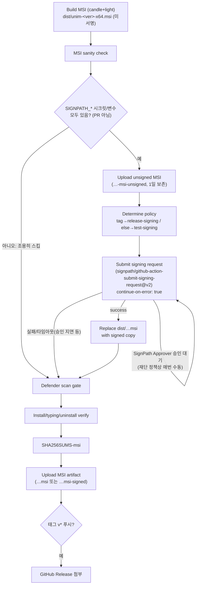

# UNIM Windows 코드 서명 — SignPath Foundation

> 작성: 2026-09-04. 대상: `unim_tsf.dll` · `unim_tsf32.dll` · `unim-settings.exe` ·
> `unim-popup-win.exe` · MSI 자체(`unim-<ver>-x64.msi`)의 Authenticode 서명.
> CI 배선: `.github/workflows/windows-msi.yml`. 아티팩트 구성:
> `installer/signpath/artifact-configuration.xml`.

## 0. 왜 서명하나 — 2026-09-03 오탐 사고

2026-09-03 회사컴에서 Windows Defender 가 `unim_tsf.dll`(0.4.1)을
`Trojan:Win32/Bearfoos.B!ml` 로 오판해 DLL·CLSID 레지스트리 키를 하루 4회
격리했다. 실측상 후킹·인젝션 API 없음, 엔트로피 정상 — 원인은 배포 위생
3종 결핍이었다: **① Authenticode 무서명 ② `VERSIONINFO` 공란 ③ 낮은 배포량
(low prevalence)**. ②는 이미 각 크레이트 `build.rs`(`build-support/version_rc.rs`
공유 헬퍼)로 메웠고, ③은 Defender 능동 스캔 게이트(`scripts/ci/verify-msi.ps1
-Phase scan`)로 조기 감지한다. 이 문서는 ①을 메운다.

상세 경위: `~/obsidian/2ndBrain/2 Projects/ATIT/unim/일지/2026-09-03 Defender
오탐 격리 — TSF DLL 복구와 소스 대응.md` (회사 볼트). 사용자 가시 안내는
`docs/user/troubleshooting/README.md` §4-W.

## 1. 왜 SignPath Foundation 인가

| | Azure Trusted Signing | **SignPath Foundation (OSS)** |
|---|---|---|
| 비용 | ~$9.99/월 | **무료** (OSS 심사 통과 시) |
| 한국 개인 신원검증 | 지원국 미포함 가능성(Public Trust 인증서, 2026-07 기준 미확인) | **불요** — 신원검증 대신 저장소·릴리스 검증 |
| 인증서 주체 | 신청자 개인/조직명 | **"SignPath Foundation"** (프로젝트가 아니라 재단 명의) |
| CI 연동 | `azure/trusted-signing-action` | `signpath/github-action-submit-signing-request` |

`docs/dev/windows/DEPLOY-TRUST-PLAN.md` §a-2 의 결정 기준(개인 신원검증 가능
여부)이 불확실한 채로 남아 있으므로, 이 문서는 신원검증이 필요 없는
SignPath Foundation OSS 경로를 먼저 배선한다. Azure 경로가 나중에 열리면
CI 스켈레톤은 그대로 두고 서명 스텝 내용물만 교체할 수 있다(같은 문서 표
하단 각주).

## 2. 기현님이 할 일 — 신청·설정 체크리스트

### 2.1 자격 요건 (signpath.org/terms.html, 실제 확인됨)

- [ ] **OSI 승인 라이선스** — UNIM 은 MIT(`LICENSE`)로 충족.
- [ ] **비독점 코드** — 상용 이중 라이선스 없음, 서드파티 System Library
      이외 독점 코드 없음(NOTICE.txt 의 libhangul-hanja BSD-3 · Unicode CLDR
      은 System Library 취급 가능해 보이나 최종 판단은 SignPath 심사).
- [ ] **유지보수 중 + 이미 릴리스된 형태** — GitHub Releases 에 기존 MSI
      존재(v0.4.0+)로 충족.
- [ ] **기능 문서화** — README/다운로드 페이지에 기능 설명 존재.
- [ ] **팀 역할 구조 + MFA** — Authors(커밋 권한)/Reviewers(PR 리뷰)/
      Approvers(서명 승인) 를 GitHub 팀/권한 그룹으로 정의하고, 모든
      구성원이 GitHub·SignPath 양쪽에 **MFA 필수**. 1인 프로젝트라도
      "Owner = Author = Approver" 로 명시는 필요.
- [ ] **"Code signing policy" 페이지 게시** — 프로젝트 홈/다운로드 페이지에
      섹션 제목 "**Code signing policy**" 로: "Free code signing provided
      by SignPath.io, certificate by SignPath Foundation" 문구, 팀 역할별
      멤버(또는 GitHub 팀 링크), 개인정보 처리방침(또는 "사용자 요청 없이
      네트워크로 정보를 전송하지 않는다" 문구) 을 명시. → README.md 또는
      웹사이트(atit.org)에 추가 (이 diff 범위 밖 — 별도 작업으로 승인 필요).

> [!warning] 신청 폼 필드는 확인 못함
> `https://signpath.org/apply.html` 은 JS 로 렌더링되는 폼(임베드 위젯으로
> 추정)이라 이 조사(ctx_fetch_and_index, 정적 HTML 파서)로 실제 입력 필드
> 목록을 못 읽었다. 신청 시 직접 페이지를 열어 저장소 URL·라이선스·팀
> 구조를 준비해 두면 될 것으로 보이나, **정확한 폼 항목은 미확인**이다.

### 2.2 신청 → 승인 후 설정 (SignPath 앱, app.signpath.io)

1. **신청**: <https://signpath.org/apply.html> 에서 무료 SignPath.io
   구독 신청 (재단이 "SignPath Foundation" 명의로 인증서를 발급/관리 —
   신청자는 인증서를 직접 소유하지 않는다).
2. 승인 후 앱에 로그인해:
   - **조직(Organization)** 확인 — `organization-id`(GUID) 를 얻는다
     (Setting up Projects 문서 기준: 앱 UI 의 조직 설정 화면에서 확인).
   - **프로젝트(Project)** 생성 — `project-slug` 를 얻는다.
   - **Artifact Configuration** 등록 — `installer/signpath/artifact-configuration.xml`
     내용을 그대로 붙여넣어 새 구성을 만든다(파일 경로 patterns 는 이미
     `unim.wxs` 의 File 목록과 1:1 — 새 PE 를 wxs 에 추가하면 이 XML 도 함께
     갱신). 슬러그가 생기면 `SIGNPATH_ARTIFACT_CONFIGURATION_SLUG` 로 등록
     (선택 — 프로젝트 기본 구성 하나만 쓸 거면 비워도 됨).
   - **Signing Policy** 2개 생성 — 관례적으로 `test-signing` (일반 브랜치
     푸시용) 과 `release-signing` (태그 릴리스용). 두 슬러그 이름은
     SignPath 예제 문서 전반이 쓰는 관례이지 시스템 예약어는 아니므로,
     실제로 만든 슬러그 이름을 CI 값과 맞춰야 한다(아래 워크플로가
     `refs/tags/v*` 만 `release-signing`, 그 외엔 `test-signing` 사용).
   - **Trusted Build System 연결** — 조직에 미리 만들어진 **"GitHub.com"**
     Trusted Build System 커넥터를 프로젝트에 **Link**(프로젝트 화면 →
     "Trusted build systems" 섹션 → Link). 소스 코드/빌드 오리진 정책이
     필요하면 [SignPath GitHub App](https://github.com/apps/signpath) 을
     저장소에 설치.
   - **API 토큰** 발급 — 전용 CI 사용자(User) 또는 본인 계정에 API 토큰
     추가(SignPath 문서 "Managing Users" → CI 계정 권장).
3. **GitHub 저장소 시크릿/변수 등록** (Settings → Secrets and variables →
   Actions):

   | 이름 | 종류 | 값 |
   |---|---|---|
   | `SIGNPATH_API_TOKEN` | **Secret** | 위 API 토큰 |
   | `SIGNPATH_ORGANIZATION_ID` | Variable | 조직 GUID |
   | `SIGNPATH_PROJECT_SLUG` | Variable | 프로젝트 슬러그 |
   | `SIGNPATH_ARTIFACT_CONFIGURATION_SLUG` | Variable (선택) | Artifact Configuration 슬러그 |

   organization-id/project-slug 를 Variable(비밀 아님)로 둔 이유: SignPath
   공식 예제(`signpath/github-action-submit-signing-request` README)도 이
   둘을 워크플로 YAML 에 평문으로 적는다 — 노출돼도 위험하지 않다(승인
   게이트가 실제 방어선). `SIGNPATH_API_TOKEN` 만 Secret.

4. **매 릴리스 승인** — SignPath Foundation OSS 정책상 **모든 서명
   요청은 프로젝트 Approver 의 수동 승인**이 필요하다(재단 자체 정책,
   자동화 불가). 태그 릴리스를 배포할 때는 SignPath 앱 알림/이메일을 보고
   승인해야 서명된 MSI 가 나온다 — 승인하지 않으면 워크플로는 미서명
   MSI 로 조용히 폴백한다(아래 §3 참고, 실패로 CI 를 막지 않음).

## 3. CI 흐름 (`.github/workflows/windows-msi.yml`)



핵심 설계:

- **조용한 스킵**: 시크릿/변수 중 하나라도 없으면(미신청 상태, fork PR)
  서명 블록 전체를 건너뛰고 기존 미서명 플로우가 그대로 통과한다 — 실패가
  아니다. 같은 저장소의 `pull_request` 이벤트도 명시적으로 제외(승인
  대기로 PR 마다 블로킹되는 것 방지 — `DEPLOY-TRUST-PLAN.md` §a-4 가 이미
  제안한 `if: github.event_name != 'pull_request'` 방침과 동일).
- **정책 분기**: `refs/tags/v*` 푸시만 `release-signing`, 그 외(브랜치
  푸시)는 `test-signing`.
- **승인 지연에도 안전**: `Submit SignPath signing request` 스텝은
  `continue-on-error: true` — SignPath 재단 정책상 승인이 필수라 즉시
  완료되지 않을 수 있는데, 이 스텝이 실패/타임아웃해도 이후 스텝은
  `dist/unim-<ver>-x64.msi` 를 그대로(미서명) 이어받아 Defender 스캔·설치
  검증·릴리스 첨부까지 회귀 없이 진행한다.
- **다운스트림 무변경**: 서명이 성공하면 `Replace MSI with SignPath-signed
  version` 스텝이 같은 경로(`dist/unim-<ver>-x64.msi`)를 서명본으로
  덮어쓰므로, 이후의 Defender 스캔·설치/타이핑/제거 검증·SHA256SUMS
  생성·GitHub Release 첨부 스텝은 **한 줄도 고치지 않았다** — 파일 경로가
  같으므로 서명 여부를 몰라도 그대로 동작한다.
- **아티팩트 이름 구분**: 서명 요청 제출용 중간 산출물은
  `unim-<ver>-x64-msi-unsigned`(1일 보존, 서명 파이프라인 디버깅용).
  최종 게시 아티팩트는 서명됐으면 `unim-<ver>-x64-msi-signed`, 아니면
  기존 이름 `unim-<ver>-x64-msi` 그대로(하위 호환).

## 4. 아티팩트 구성 (`installer/signpath/artifact-configuration.xml`)

`unim.wxs` 가 패키징하는 PE(실행 가능 바이너리) 전수를 딥사인한다:

| wxs Component | File | 서명 |
|---|---|---|
| `UnimTsfDll` | `unim_tsf.dll` (x64) | ✅ pe-file |
| `UnimTsfDll32` | `unim_tsf32.dll` (x86/WOW64) | ✅ pe-file |
| `UnimTsfSettingsExe` | `unim-settings.exe` | ✅ pe-file |
| `UnimPopupWinExe` | `unim-popup-win.exe` | ✅ pe-file |
| `RegisterScripts` | `register-tsf.bat` / `unregister-tsf.bat` | ❌ (Authenticode 대상 아님 — PE 가 아니다) |
| 그 외 | `.txt`/`.html` | ❌ (실행 파일 아님) |

내부 4개 PE 를 먼저 서명한 뒤 MSI 를 재패키징하고 MSI 자체도 서명하는
"딥사인"(SignPath 문서: [Deep signing of nested
files](https://about.signpath.io/documentation/artifact-configuration#deep-signing-of-nested-files))
1-pass 로 처리된다. 최상위가 `<zip-file>` 인 이유는 `actions/upload-artifact@v4`
가 단일 파일도 서버에서 zip 으로 감싸기 때문(SignPath 커넥터가 원본 zip 을
그대로 받는다).

**wxs 에 PE 를 추가/제거하면 이 XML 도 함께 갱신할 것** — 검증 스크립트
없이는 CI 가 자동으로 알려주지 않는다(수동 대조 필요, `docs/dev/testing/`
쪽에 자동 대조 스크립트 추가는 이 diff 범위 밖).

## 5. 로컬에서 서명 검증하기 (Windows 머신 필요 — gofu 는 Linux 라 불가)

```powershell
# 서명 상태 확인
Get-AuthenticodeSignature .\unim-0.4.x-x64.msi | Format-List *

# signtool (Windows SDK) 로 상세 검증 — 신뢰 체인 + 타임스탬프까지
signtool verify /pa /all .\unim-0.4.x-x64.msi

# MSI 내부 PE 도 개별 확인하려면 먼저 추출
msiexec /a unim-0.4.x-x64.msi /qn TARGETDIR=C:\extract
Get-AuthenticodeSignature C:\extract\UNIM\unim_tsf.dll
```

`Status` 가 `Valid` 이고 `SignerCertificate.Subject` 에 `SignPath Foundation`
이 있으면 정상. `TimeStamperCertificate` 가 비어 있지 않아야 인증서 만료
후에도 서명이 유효하다.

## 6. 인증서 만료·갱신

SignPath Foundation 발급 인증서는 재단이 소유·갱신을 관리한다(프로젝트가
직접 갱신하지 않는다) — 만료 임박 시 재단에서 별도 공지가 있을 것으로
보이나 **자동 롤오버 절차는 이 조사로 확인하지 못했다**. 매 서명에 RFC 3161
타임스탬프가 함께 찍히므로, 인증서가 만료돼도 **만료 전에 서명된 기존
MSI 는 계속 유효**하다(`signtool verify` 의 타임스탬프 검증 기준).

## 7. 대안 (한 줄씩)

- **Azure Trusted Signing**: 월정액(~$9.99), 72시간 단기 인증서 자동
  회전, `azure/trusted-signing-action` 공식 액션 — 한국 개인 신원검증
  가능 여부만 확인되면 CI 스켈레톤은 그대로 두고 서명 스텝 내용물만
  교체 가능(`DEPLOY-TRUST-PLAN.md` §a-2).
- **Certum (OV 인증서)**: 하드웨어 토큰/클라우드 HSM 필요, 유료(~$200~400/년),
  평판 0에서 시작 — SignPath Foundation 자격을 잃거나(예: 상용 전환) 재단
  정책과 안 맞을 때의 폴백.
