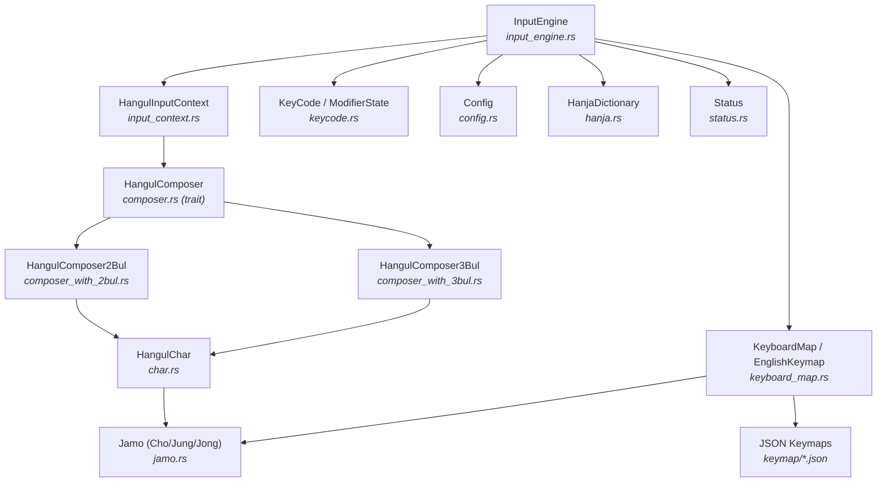
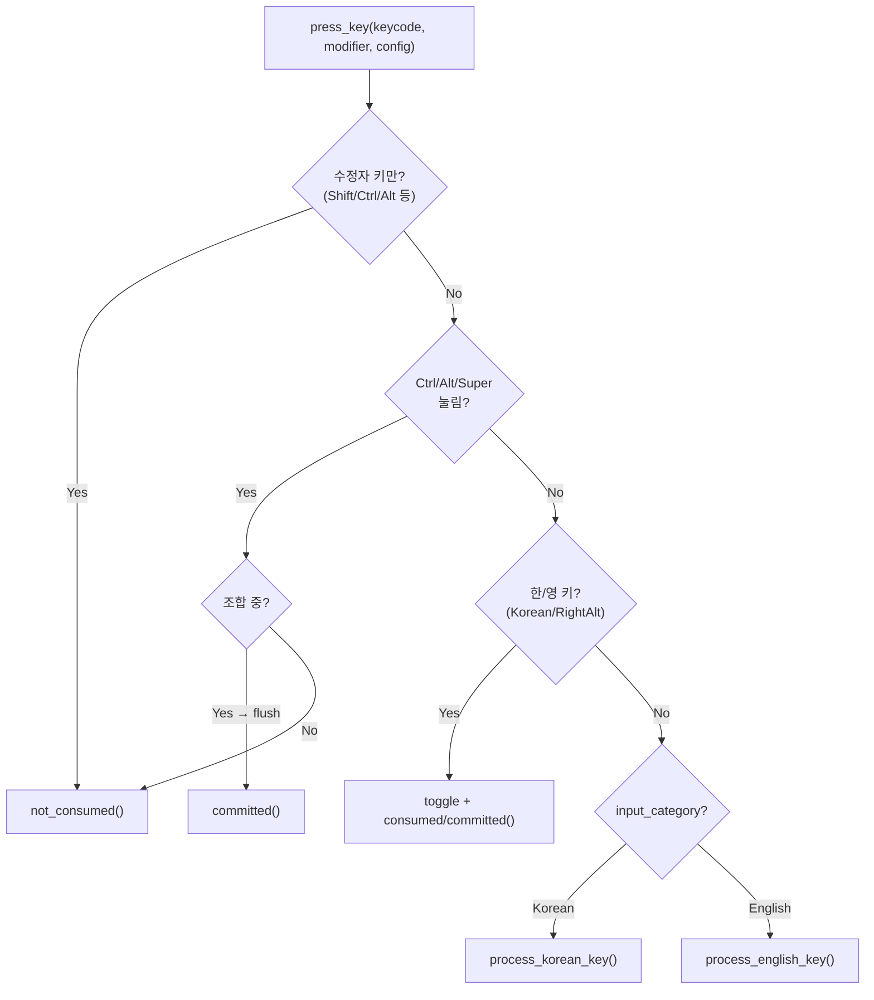

# UNIM 코어 엔진 세부 기능 명세

> `src/`는 UNIM 프로젝트의 **핵심 라이브러리 크레이트**입니다.
> 한글 자모 조합, 키보드 레이아웃 매핑, 입력 상태 관리, 한자 변환 등
> 모든 입력 처리 로직이 이 디렉토리에 집약되어 있습니다.
> 프론트엔드(GTK/Qt/XIM/Wayland)와 데몬은 이 크레이트의 소비자입니다.

---

## 1. 아키텍처 개요

### 1.1 모듈 계층 구조

```
src/
├── lib.rs                  # 크레이트 루트 — 모듈 선언
├── input_engine.rs         # ★ 최상위 엔진 — 키 입력 진입점
├── config.rs               # 설정 구조체 (YAML 직렬화)
├── keycode.rs              # 키코드 추상화 (evdev/X11 → KeyCode)
├── status.rs               # 상태 파일 공유 (~/.cache/unim/status)
├── logging.rs              # 통합 로깅 (unim_log! 매크로)
├── hangul/                 # 한글 조합 서브시스템
│   ├── mod.rs              #   모듈 선언 + re-exports
│   ├── jamo.rs             #   자모 열거형 (Cho/Jung/Jong/JamoEnum)
│   ├── char.rs             #   유니코드 음절 조합 (HangulChar)
│   ├── composer.rs         #   조합기 트레이트 + 기본 구현 (BaseHangulComposer)
│   ├── composer_with_2bul.rs  두벌식 조합 (도깨비불 현상 포함)
│   ├── composer_with_3bul.rs  세벌식 조합
│   ├── input_context.rs    #   조합 세션 관리 (HangulInputContext)
│   └── hanja.rs            #   한자 사전 (빌드 시 임베드)
├── keystroke/              # 키보드 레이아웃 매핑
│   ├── mod.rs              #   JSON 키맵 로드 + 변환 유틸리티
│   ├── keyboard_map.rs     #   영어→자모 매핑 생성
│   ├── keystrokes_to_korean.rs  키스트로크 → 한글 변환
│   ├── korean_to_keystrokes.rs  한글 → 키스트로크 역변환
│   └── keymap/             #   JSON 키맵 데이터 (9개)
│       ├── en_qwerty.json      QWERTY
│       ├── en_dvorak.json      Dvorak
│       ├── en_colemak.json     Colemak
│       ├── en_colemak_dh.json  Colemak-DH
│       ├── en_workman.json     Workman
│       ├── ko_2bulstd.json     두벌식 표준
│       ├── ko_3bul390.json     세벌식 390
│       ├── ko_3bul391.json     세벌식 최종
│       └── ko_3bul_noshift.json  세벌식 순아래
└── data/
    └── hanja.txt           # 한자 사전 원본 (libhangul 호환)
```

### 1.2 코드 규모

| 영역 | 파일 수 | 코드 행 | 바이트 |
|------|---------|---------|--------|
| 엔진 + 설정 + 상태 | 4 | ~1,970 | 62KB |
| 한글 조합 (`hangul/`) | 8 | ~3,100 | 144KB |
| 키스트로크 매핑 (`keystroke/`) | 4+9 JSON | ~620 | 59KB |
| 로깅 | 1 | 71 | 2KB |
| **합계** | **~26** | **~5,800** | **~267KB** |

### 1.3 의존 흐름



---

## 2. InputEngine — 키 입력의 심장

### 2.1 구조체

```rust
pub struct InputEngine {
    input_category: InputCategory,          // 현재 모드 (Korean/English)
    korean_context: HangulInputContext,      // 한글 조합 세션
    commit_buffer: String,                  // 확정된 텍스트 버퍼
    preedit_cache: String,                  // 조합 중 텍스트 캐시
    keyboard_map: Option<HashMap<char, JamoEnum>>,  // 영문→자모 매핑
    english_keymap: EnglishKeymap,          // 영어 레이아웃 키맵
    english_layout: EnglishLayout,          // 영어 레이아웃 설정
    korean_layout: KoreanLayout,            // 한국어 레이아웃 설정
    hanja_dict: Arc<HanjaDictionary>,       // 한자 사전 (공유)
    hanja_candidates: Vec<HanjaEntry>,      // 현재 한자 후보
    hanja_mode: bool,                       // 한자 선택 모드
    hanja_target: String,                   // 한자 변환 대상 음절
}
```

### 2.2 InputResult — 6가지 결과 패턴

| 팩토리 메서드 | consumed | preedit_changed | commit_changed | 사용 시점 |
|--------------|----------|-----------------|----------------|-----------|
| `not_consumed()` | ✗ | ✗ | ✗ | 엔진이 처리하지 않음 → 앱으로 전달 |
| `consumed()` | ✓ | ✗ | ✗ | 키 소비만 (한/영 전환 등) |
| `preedit_updated()` | ✓ | ✓ | ✗ | 조합 중 갱신 (자모 입력, Backspace) |
| `committed()` | ✓ | ✓ | ✓ | 문자 확정 (음절 완성, Space 등) |
| `committed_passthrough()` | ✗ | ✓ | ✓ | 조합 커밋 + 키 통과 (Enter, Tab, Escape) |
| `hanja_candidates()` | ✓ | ✗ | ✗ | 한자 후보 준비됨 |

> [!IMPORTANT]
> `committed_passthrough()`는 UNIM의 핵심 설계 중 하나입니다.
> Enter/Tab/Escape 같은 특수키가 조합을 확정시키되, **키 자체는 애플리케이션에 전달**되어야 합니다.
> `consumed=false`이므로 프론트엔드는 커밋을 처리한 뒤 키를 그대로 애플리케이션에 전달합니다.

### 2.3 키 처리 파이프라인 (`press_key`)



### 2.4 한국어 키 처리 (`process_korean_key`)

```mermaid
flowchart TD
    K["process_korean_key(keycode, modifier)"]
    HANJA{"Hanja 키?<br/>(F9/한자)"}
    BS{"Backspace?"}
    ENTER{"Enter/Tab/<br/>Escape?"}
    SPACE{"Space?"}
    CHAR{"문자 키?<br/>(영어 키맵 조회)"}
    JAMO{"자모 매핑<br/>존재?"}
    SPECIAL{"Special 자모?"}
    COMPOSING{"조합 중?"}

    K --> HANJA
    HANJA -->|Yes| HC["start_hanja_conversion()"]
    HANJA -->|No| BS
    BS -->|Yes, 조합 중| PU["preedit_updated()"]
    BS -->|Yes, 미조합| NC["not_consumed()"]
    BS -->|No| ENTER
    ENTER -->|Yes, 조합 중| CP["committed_passthrough()"]
    ENTER -->|Yes, 미조합| NC
    ENTER -->|No| SPACE
    SPACE -->|Yes| CM["committed()"]
    SPACE -->|No| CHAR
    CHAR -->|Some(c)| JAMO
    CHAR -->|None, 조합 중| CP2["committed_passthrough()"]
    CHAR -->|None, 미조합| NC2["not_consumed()"]
    JAMO -->|Yes| SPECIAL
    JAMO -->|No| SYM["기호: flush + committed()"]
    SPECIAL -->|Yes| SYM2["Special 문자 커밋"]
    SPECIAL -->|No| PROC["process_jamo → preedit/committed"]
```

> [!NOTE]
> **CapsLock 처리 차이**: 한국어 모드에서는 CapsLock을 **무시**합니다.
> Shift만 적용되어 쌍자음(ㄲ, ㄸ 등)을 입력할 수 있습니다.
> 영어 모드에서는 `Shift XOR CapsLock` 로직으로 표준 대소문자 전환을 지원합니다.

### 2.5 영어 키 처리 (`process_english_key`)

```
1. lower_char = english_keymap.get_char(keycode, false)
2. is_alpha = lower_char가 알파벳?
3. shifted:
   → 알파벳: Shift XOR CapsLock (둘 다 켜면 소문자)
   → 숫자/기호: Shift만 적용
4. ch = english_keymap.get_char(keycode, shifted)
5. ch → commit_buffer → committed()
6. None → not_consumed()
```

### 2.6 레이아웃 핫스왑

```rust
pub fn set_korean_layout(&mut self, layout: KoreanLayout) {
    // 1. 조합 중이면 flush
    // 2. keyboard_map 재생성 (영어↔한국어 매핑)
    // 3. ComposerType 결정 (TwoBul/ThreeBul)
    // 4. HangulInputContext 재생성
}

pub fn set_english_layout(&mut self, layout: EnglishLayout) {
    // 1. 조합 중이면 flush
    // 2. keyboard_map 재생성
    // 3. english_keymap 재생성 (JSON 기반)
}
```

---

## 3. 설정 시스템 (`config.rs`)

### 3.1 구조 계층

```yaml
# ~/.config/unim/config.yaml
engine:
  default_category: Korean          # InputCategory
  mode_sharing: Global              # ModeSharingMode
  korean:
    layout: Dubeolsik               # KoreanLayout
  english:
    layout: Qwerty                  # EnglishLayout
  auto_switch:
    enabled: false                  # bool
    threshold: 0.5                  # f64
```

```rust
pub struct Config {
    pub engine: EngineConfig,       // config_path, last_mtime 포함
}

pub struct EngineConfig {
    pub default_category: InputCategory,
    pub mode_sharing: ModeSharingMode,
    pub korean: KoreanConfig,       // { layout: KoreanLayout }
    pub english: EnglishConfig,     // { layout: EnglishLayout }
    pub auto_switch: AutoSwitchConfig,
}
```

### 3.2 열거형 정의

#### InputCategory

| 값 | 설명 |
|----|------|
| `Korean` (기본) | 한국어 입력 모드 |
| `English` | 영어 입력 모드 |

#### ModeSharingMode

| 값 | 설명 |
|----|------|
| `Global` (기본) | 모든 컨텍스트가 동일한 모드 공유 |
| `PerApp` | 각 InputContext가 독립 모드 유지 |
| `PerWindow` | 각 창이 독립 모드 유지 |

#### KoreanLayout

| 값 | repr | 세벌식? | 설명 |
|----|------|---------|------|
| `Dubeolsik` (기본) | 0 | ✗ | 두벌식 표준 |
| `Sebeolsik390` | 1 | ✓ | 세벌식 390 |
| `Sebeolsik391` | 2 | ✓ | 세벌식 최종 |
| `SebeolsikNoShift` | 3 | ✓ | 세벌식 순아래 |

#### EnglishLayout

| 값 | repr | keymap 파일 | 설명 |
|----|------|-------------|------|
| `Qwerty` (기본) | 0 | `en_qwerty` | 표준 QWERTY |
| `Dvorak` | 1 | `en_dvorak` | Dvorak |
| `Colemak` | 2 | `en_colemak` | Colemak |
| `ColemakDh` | 3 | `en_colemak_dh` | Colemak-DH (인체공학 개선) |
| `Workman` | 4 | `en_workman` | Workman |

### 3.3 설정 관리 메서드

| 메서드 | 기능 |
|--------|------|
| `Config::new()` | 기본값 생성 |
| `Config::default_config_path()` | `~/.config/unim/config.yaml` |
| `Config::load_from_default_path()` | 파일 로드 (없으면 기본값 + 파일 생성) |
| `Config::save_to_default_path()` | 파일 저장 |
| `Config::reload_if_changed()` | 파일 수정 시간 비교, 변경 시 리로드 (Throttling) |
| `Config::ensure_config_file()` | 파일 없으면 기본값으로 생성 |

> [!NOTE]
> `reload_if_changed()`는 **매 키 입력마다** 호출되므로, 파일 시스템 접근을 최소화하기 위해
> 내부적으로 `last_mtime` 캐시와 비교하여 실제 변경 시에만 파싱합니다.

---

## 4. 한글 조합 서브시스템 (`hangul/`)

### 4.1 계층 설계 — Strategy 패턴

```
                  ┌─────────────────────────────┐
                  │    HangulComposer (trait)    │
                  │                             │
                  │  add_jamo() → Option<char>   │
                  │  remove_jamo()               │
                  │  compose_korean()            │
                  │  force_compose_korean()      │
                  │  is_compose()                │
                  │  compose_cho/jung/jong()     │
                  └──────────┬──────────────────┘
                             │ impl
              ┌──────────────┴──────────────┐
              │                             │
    ┌─────────┴─────────┐        ┌─────────┴─────────┐
    │ HangulComposer2Bul│        │ HangulComposer3Bul│
    │                   │        │                   │
    │ • 도깨비불 현상   │        │ • 초/중/종 분리키 │
    │ • 초→종 자동변환  │        │ • 초성 조합       │
    │ • 겹받침 분리     │        │ • 순서 위반 감지  │
    └─────────┬─────────┘        └─────────┬─────────┘
              │ delegate                   │ delegate
              └──────────┬─────────────────┘
                         │
               ┌─────────┴─────────┐
               │ BaseHangulComposer │
               │                   │
               │ • jamo_queue      │
               │ • combined_jamo   │
               │ • current_korean  │
               │ • last_jamo_queue │
               └─────────┬─────────┘
                         │ uses
               ┌─────────┴─────────┐
               │    HangulChar     │
               │                   │
               │ • cho/jung/jong   │
               │ • to_syllable()   │
               │ • 유니코드 연산   │
               └───────────────────┘
```

### 4.2 HangulInputContext — 조합 세션 관리

```rust
pub struct HangulInputContext {
    composer_type: ComposerType,         // TwoBul / ThreeBul
    composer: Box<dyn HangulComposer>,   // 동적 디스패치
    preedit: String,                     // 현재 조합 중 문자열
    committed: String,                   // 확정된 문자열
}
```

#### 주요 메서드

| 메서드 | 설명 |
|--------|------|
| `process_jamo(jamo)` | 자모 입력 → 조합 → preedit/committed 갱신 |
| `backspace()` | 마지막 자모 제거 |
| `commit()` | 현재 조합 강제 확정 |
| `get_preedit()` / `get_committed()` | 버퍼 조회 |
| `is_composing()` | 조합 중 여부 |
| `set_composer_type()` | 조합기 전환 (조합 중이면 먼저 확정) |

#### 조합 흐름 예시 (두벌식: "한글" 입력)

| 입력 | jamo_queue | preedit | committed | 설명 |
|------|-----------|---------|-----------|------|
| ㅎ | [Cho(H)] | ㅎ | | 초성 입력 |
| ㅏ | [Cho(H), Jung(A)] | 하 | | 중성 결합 → 음절 |
| ㄴ | [Cho(H), Jung(A), Jong(N)] | 한 | | 종성 결합 |
| ㄱ | [Cho(G)] | ㄱ | 한 | 도깨비불: "한" 확정, "ㄱ" 새 음절 |
| ㅡ | [Cho(G), Jung(Eu)] | 그 | 한 | 중성 결합 |
| ㄹ | [Cho(G), Jung(Eu), Jong(R)] | 글 | 한 | 종성 결합 |

### 4.3 도깨비불 현상 (두벌식 핵심)

한국어 두벌식 입력의 가장 중요한 특성은 **도깨비불 현상**입니다.

```
"한" + 'ㄱ' (초성) 입력 시:
  ↓
  종성 ㄴ과 구별 불가 (두벌식에서는 초성과 종성이 같은 키)
  ↓
  "한ㄱ"으로 일단 조합 유지
  ↓
  다음 입력이 중성이면: "한" 확정 + "ㄱ"을 새 음절의 초성으로 분리
  다음 입력이 초성이면: 겹받침 가능 여부 확인 → 불가능하면 새 음절
```

```rust
// composer_with_2bul.rs
fn handle_dokkaebi_effect(&mut self, jamo: JamoEnum) -> Option<Option<char>> {
    // 종성 다음에 중성이 입력되면:
    // 1. 마지막 종성을 큐에서 pop
    // 2. 현재까지의 글자를 force_compose → 완성 char 반환
    // 3. 제거된 종성을 Cho로 변환 → 새 글자의 초성으로 push
}
```

### 4.4 세벌식 규칙 위반 감지

세벌식은 초성/중성/종성이 물리적으로 다른 키에 할당되므로 도깨비불 현상이 없습니다.
대신 **입력 순서 위반**을 감지하여 새 음절을 시작합니다:

| 위반 유형 | 큐 상태 | 입력 | 동작 |
|-----------|---------|------|------|
| `ChoWithoutJung` | 초+중 없음 | 초성 | 이전 확정, 새 음절 |
| `JongWithoutJung` | 중 없음 | 종성 | 개별 자모 출력 |
| `ChoAfterJungOrJong` | 중 또는 종 있음 | 초성 | 이전 확정, 새 음절 |
| `JungAfterJong` | 종 있음 | 중성 | 이전 확정, 새 음절 |

### 4.5 자모 조합 규칙

#### 중성 조합 (2벌/3벌 공통)

| 첫째 | 둘째 | 결과 | 예 |
|------|------|------|----|
| ㅗ | ㅏ | ㅘ | 화 |
| ㅗ | ㅐ | ㅙ | 왜 |
| ㅗ | ㅣ | ㅚ | 외 |
| ㅜ | ㅓ | ㅝ | 원 |
| ㅜ | ㅔ | ㅞ | 웬 |
| ㅜ | ㅣ | ㅟ | 위 |
| ㅡ | ㅣ | ㅢ | 의 |

#### 종성 조합

| 첫째 | 둘째 | 결과 | 예 |
|------|------|------|----|
| ㄱ | ㅅ | ㄳ | 삯 |
| ㄴ | ㅈ | ㄵ | 않 |
| ㄴ | ㅎ | ㄶ | 많 |
| ㄹ | ㄱ | ㄺ | 읽 |
| ㄹ | ㅁ | ㄻ | 삶 |
| ㄹ | ㅂ | ㄼ | 밟 |
| ㄹ | ㅅ | ㄽ | — |
| ㄹ | ㅌ | ㄾ | — |
| ㄹ | ㅍ | ㄿ | — |
| ㄹ | ㅎ | ㅀ | — |
| ㅂ | ㅅ | ㅄ | 없 |
| ㅅ | ㅅ | ㅆ | 있 |

### 4.6 HangulChar — 유니코드 음절 연산

유니코드 한글 음절 계산 공식:

```
음절 코드 = 0xAC00 + (초성 × 21 + 중성) × 28 + 종성
```

| 상수 | 값 | 의미 |
|------|-----|------|
| `SYLLABLE_BASE` | 0xAC00 | 한글 음절 시작점 ('가') |
| `CHOSEONG_NUMBER` | 19 | 초성 개수 |
| `JUNGSEONG_NUMBER` | 21 | 중성 개수 |
| `JONGSEONG_NUMBER` | 28 | 종성 개수 (받침 없음 포함) |
| `SYLLABLE_NUMBER` | 11,172 | 총 음절 수 |

```rust
impl HangulChar {
    pub fn to_syllable(&self) -> Option<char> {
        // 초성 + 중성이 최소 조건
        let cho = self.cho?;
        let jung = self.jung?;
        let jong = self.jong.unwrap_or_default();  // 0 = 받침 없음
        
        let code = SYLLABLE_BASE
            + (cho as u32) * JUNGSEONG_NUMBER * JONGSEONG_NUMBER
            + (jung as u32) * JONGSEONG_NUMBER
            + (jong as u32);
        
        char::from_u32(code)
    }
}
```

### 4.7 자모 열거형 (`jamo.rs`)

```rust
pub enum JamoEnum {
    Cho(Cho),           // 초성 (19종)
    Jung(Jung),         // 중성 (21종)
    Jong(Jong),         // 종성 (27종 + None)
    Special(char),      // 비-한글 특수문자 (세벌식 레이아웃 전용)
}
```

#### Cho (초성) — 19개

| 값 | 문자 | 값 | 문자 | 값 | 문자 |
|----|------|----|------|----|------|
| G | ㄱ | SsG | ㄲ | N | ㄴ |
| D | ㄷ | SsD | ㄸ | R | ㄹ |
| M | ㅁ | B | ㅂ | SsB | ㅃ |
| S | ㅅ | SsS | ㅆ | — | ㅇ |
| J | ㅈ | SsJ | ㅉ | Ch | ㅊ |
| K | ㅋ | T | ㅌ | P | ㅍ |
| H | ㅎ | | | | |

#### Jung (중성) — 21개 / Jong (종성) — 27개

(초성→종성 변환 테이블 포함, 겹받침 정의)

---

## 5. 키보드 레이아웃 매핑 (`keystroke/`)

### 5.1 JSON 키맵 구조

모든 키맵은 **빌드 시 `include_str!()`로 바이너리에 임베드**됩니다.

```json
// en_qwerty.json (예시)
{
  "q": "q", "Q": "Q",
  "w": "w", "W": "W",
  // ...
}

// ko_2bulstd.json (예시)  
{
  "q": "ㅂ", "Q": "ㅃ",
  "w": "ㅈ", "W": "ㅉ",
  // ...
}
```

### 5.2 매핑 생성 흐름

```
영어 JSON + 한글 JSON → KeyboardMap::create_keyboard_map_from_str()
                        → HashMap<char, JamoEnum>
```

핵심: **영어 키맵의 출력 문자를 키로, 한글 키맵의 출력 자모를 값으로** 매핑합니다.

예시 (QWERTY + 두벌식):

| QWERTY 출력 | 두벌식 출력 | 결과 매핑 |
|------------|-----------|----------|
| `q` → `q` | `q` → `ㅂ` | `'q' → Cho(Bieup)` |
| `Q` → `Q` | `Q` → `ㅃ` | `'Q' → Cho(SsangBieup)` |

이렇게 하면 Dvorak 등 **다른 영어 레이아웃**에서도 한글 매핑이 자연스럽게 동작합니다.

### 5.3 EnglishKeymap

```rust
pub struct EnglishKeymap {
    normal: HashMap<KeyCode, char>,   // 일반 키 → 문자
    shifted: HashMap<KeyCode, char>,  // Shift + 키 → 문자
}

impl EnglishKeymap {
    pub fn from_json(json: &str) -> Self;
    pub fn get_char(&self, keycode: KeyCode, shifted: bool) -> Option<char>;
}
```

---

## 6. 키코드 추상화 (`keycode.rs`)

### 6.1 KeyCode 열거형

물리적 키보드 키를 프론트엔드 독립적으로 추상화합니다.

```rust
#[repr(u16)]
pub enum KeyCode {
    // 알파벳 (A=0x04 ~ Z=0x1D) — USB HID 기준
    A = 0x04, B = 0x05, ..., Z = 0x1D,
    
    // 숫자 (Num1=0x1E ~ Num0=0x27)
    Num1 = 0x1E, ..., Num0 = 0x27,
    
    // 기능키
    Enter = 0x28, Escape = 0x29, Backspace = 0x2A,
    Tab = 0x2B, Space = 0x2C,
    
    // 기호
    Minus = 0x2D, Equal = 0x2E, ...
    
    // 한국어 전용
    Korean = 0x90,  // 한/영 전환
    Hanja = 0x91,   // 한자 변환
    
    // 수정자
    LeftControl = 0xE0, LeftShift = 0xE1, ...
    
    Unknown = 0xFFFF,
}
```

### 6.2 변환 메서드

| 메서드 | 입력 | 설명 |
|--------|------|------|
| `from_evdev_keycode(code)` | evdev keycode | Wayland/XIM 프론트엔드용 |
| `from_x11_keycode(code)` | X11 keycode (evdev+8) | GTK/Qt 프론트엔드용 |
| `to_char()` | — | 일반 문자 (Shift 없음) |
| `to_shifted_char()` | — | Shift 포함 문자 |
| `is_character_key()` | — | 문자 입력 키 여부 |
| `is_modifier()` | — | 수정자 키 여부 |
| `is_alpha()` | — | 알파벳(A-Z) 여부 |

### 6.3 ModifierState

```rust
#[repr(C)]
pub struct ModifierState {
    pub shift: bool,
    pub control: bool,
    pub alt: bool,
    pub super_key: bool,
    pub caps_lock: bool,
}
```

| 메서드 | 설명 |
|--------|------|
| `from_x11_mask(mask)` | X11/GDK 수정자 비트마스크 변환 |
| `is_empty()` | 수정자 없음 |
| `is_shift_only()` | Shift만 눌림 |

---

## 7. 한자 변환 시스템

### 7.1 사전 데이터

```rust
const HANJA_DATA: &str = include_str!("../data/hanja.txt");
```

- **출처**: libhangul 호환 형식
- **형식**: `한글:한자:뜻풀이` (줄 단위)
- **저장**: `HashMap<String, Vec<HanjaEntry>>` — 한글 발음을 키로 한자 목록 검색
- **임베딩**: 빌드 시 바이너리에 포함 (런타임 파일 의존 없음)

### 7.2 검색 인터페이스

```rust
pub struct HanjaDictionary {
    entries: HashMap<String, Vec<HanjaEntry>>,
}

pub struct HanjaEntry {
    pub hangul: String,     // 한글 발음 (검색 키)
    pub hanja: String,      // 한자 문자열
    pub meaning: String,    // 뜻풀이
}
```

| 메서드 | 설명 |
|--------|------|
| `search("가")` | 발음으로 전체 검색 |
| `search_last_syllable("대한민국")` | 마지막 음절("국")로 검색 |
| `entry_count()` | 총 항목 수 |
| `key_count()` | 고유 발음 키 수 |

### 7.3 엔진 레벨 한자 흐름

```
1. F9/한자 키 → start_hanja_conversion()
2. preedit의 마지막 음절 추출
3. hanja_dict.search(음절) → 후보 리스트
4. hanja_mode = true, hanja_candidates 저장
5. InputResult::hanja_candidates() 반환
6. (프론트엔드가 팝업 표시)
7. select_hanja(index) → 한자 문자열 commit
8. cancel_hanja() → 모드 해제
```

> [!IMPORTANT]
> `HanjaDictionary`는 `Arc<>`로 래핑되어 **여러 InputEngine 인스턴스 간 공유**됩니다.
> 사전 파싱은 비용이 크므로 한 번만 수행합니다.

---

## 8. 특수문자 변환 시스템 (`hangul/special_chars.rs`)

### 8.1 개요

한자 후보가 없을 때 **자모(초성) 기반 특수문자** 후보를 제공합니다.
한자 키(F9)로 트리거되며, 조합 중인 자모에 매핑된 특수문자 테이블을 반환합니다.

### 8.2 데이터 구조

```rust
/// 특수문자 카테고리 (자모별)
struct SpecialCharCategory {
    key: char,              // 자모 문자 ('ㄱ', 'ㄴ', ...)
    top_row: &'static str,  // 열 헤더 라벨 (9자, 예: "QWERTYUIO")
    chars: &'static [&'static str],  // 특수문자 배열
}
```

### 8.3 API

| 함수 | 반환 | 설명 |
|------|------|------|
| `get_special_chars(jamo)` | `Option<(&str, &[&str])>` | `(top_row, chars[])` 반환 |
| `get_special_chars_for_target(target)` | `Option<(&str, Vec<String>)>` | 문자열 기반 조회 (DBus용) |

### 8.4 자모별 특수문자 매핑

| 자모 | top_row | 문자 예시 | 총 개수 |
|------|---------|-----------|---------|
| ㄱ | `QWERTYUIO` | `$`, `%`, `₩`, `°F`, `‰`, `µℓ`, kℓ, mm, ... | ~162 |
| ㄴ | (카테고리별) | 숫자 부호, 분수, 로마 숫자 등 | 카테고리별 |
| ... | ... | ... | ... |

### 8.5 팝업 그리드 배치

```
         Q    W    E    R    T    Y    U    I    O    ← top_row (열 헤더)
    1    $    %    ₩    °F   ‰    µℓ   kℓ   mm   mg   ← row 0
    2    ...                                           ← row 1
    ...
    9    ...                                           ← row 8
```

- **최대 9열 × 9행 = 81문자/페이지** (`PAGE_SIZE = 81`)
- 81개 초과 시 **페이지 분할** (Tab/Shift+Tab으로 이동)
- 배치 순서: **열 우선** (col 0의 row 0~8 → col 1의 row 0~8 → ...)

---

## 9. 상태 파일 공유 (`status.rs`)

```
~/.cache/unim/status
```

| 내용 | 의미 |
|------|------|
| `korean\n` | 한국어 모드 |
| `english\n` | 영어 모드 |

- **목적**: 인디케이터(트레이 아이콘) 등 외부 프로그램이 현재 입력 모드를 알 수 있도록 합니다.
- **업데이트 시점**: `toggle_input_category()`, `set_input_category()` 호출 시
- **설계 의도**: DBus 시그널과 별도로, DBus에 연결하지 않은 프로그램도 상태를 조회할 수 있습니다.

---

## 10. 로깅 시스템 (`logging.rs`)

### 9.1 활성화 조건

```
UNIM_DEVELOP=1 → 로깅 활성화
```

`OnceLock`으로 프로세스 수명 동안 한 번만 체크하여 **매 호출마다 환경변수를 읽지 않습니다**.

### 9.2 출력 대상

| 대상 | 경로 |
|------|------|
| 콘솔 | `stderr` |
| 파일 | `~/.unim-errors.log` (append 모드) |

### 9.3 포맷

```
[2026/02/17 16:30:45] - [ENGINE] - 키 입력 처리: keycode=A
```

### 9.4 매크로

```rust
#[macro_export]
macro_rules! unim_log {
    ($module:expr, $($arg:tt)*) => {
        $crate::logging::log_message($module, &format!($($arg)*))
    };
}
```

---

## 11. 설계 원칙 및 핵심 의사결정

### 11.1 프론트엔드 독립성

| 설계 | 이유 |
|------|------|
| `KeyCode` 추상화 | evdev/X11/Wayland 키코드 차이 흡수 |
| JSON 키맵 임베딩 | 런타임 파일 의존 제거 |
| `InputResult` 값 객체 | 프론트엔드가 `consumed` 플래그만 보고 판단 |

### 11.2 한글 조합 분리

| 설계 | 이유 |
|------|------|
| Strategy 패턴 (2벌/3벌) | 조합 규칙 차이를 다형성으로 해결 |
| `Box<dyn HangulComposer>` | 런타임 레이아웃 전환 지원 |
| `BaseHangulComposer` 위임 | 공통 로직 중복 제거 |

### 11.3 성능 최적화

| 기법 | 적용 대상 |
|------|-----------|
| `OnceLock` 캐시 | 로깅 활성화 여부 1회 체크 |
| `Lazy<CombinedJamoMap>` | 자모 조합 테이블 1회 빌드 |
| `Arc<HanjaDictionary>` | 한자 사전 인스턴스 간 공유 |
| `include_str!()` 임베딩 | JSON 키맵 + 한자 사전 I/O 제거 |
| `preedit_cache` String | 매번 조합 재계산 방지 |
| `config.reload_if_changed()` | 파일 mtime 비교로 불필요 파싱 방지 |

### 11.4 committed_passthrough 패턴

```
Enter 키 → 조합 커밋 + 키 자체는 앱으로 전달
         → consumed=false, commit_changed=true
         → 프론트엔드: 커밋 처리 후 return false (이벤트 전파)
```

이 패턴이 없으면 Enter/Tab/Escape 입력 시:

1. 조합만 커밋되고 Enter가 씹히거나
2. Enter만 전달되고 조합이 소실됩니다.

---

## 12. 테스트

### 12.1 테스트 분포

| 모듈 | 테스트 수 | 테스트 항목 |
|------|-----------|------------|
| `input_engine.rs` | 4 | 엔진 생성, 영어 입력, 모드 토글, 리셋 |
| `hangul/input_context.rs` | 7 | 기본 조합, 커밋, Backspace, 도깨비불, clear, 타입 변경, 3벌식 |
| `hangul/hanja.rs` | 5 | 사전 로드, 단일 검색, 마지막 음절 검색, 미검색, 첫 한자 문자 |
| `keycode.rs` | 2 | evdev/X11 변환 |
| `keystroke/keystrokes_to_korean.rs` | 2 | 기본 변환, 비-한글 |
| `status.rs` | 2 | 카테고리 변환, 파일 경로 |

### 12.2 실행

```bash
cargo test -p unim
```

---

## 13. 빌드

```bash
# 라이브러리 빌드
cargo build -p unim

# 릴리스 빌드
cargo build -p unim --release
```

`build.rs`는 현재 최소한의 설정만 포함 (56 바이트).
한자 사전과 JSON 키맵은 `include_str!()` 매크로로 컴파일 타임에 임베드됩니다.
