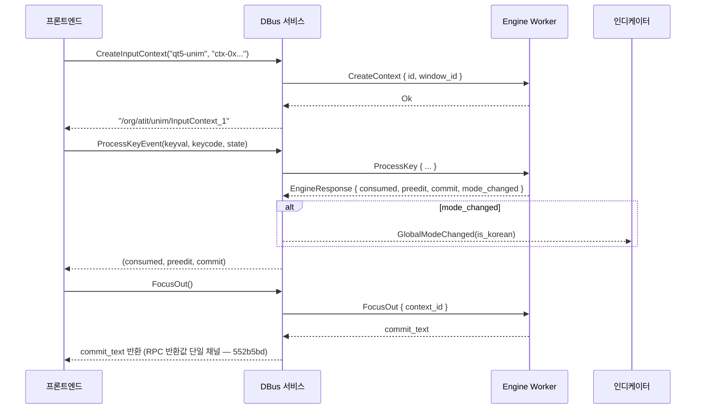

# UNIM DBus IPC 라이브러리 세부 기능 명세

> `unim-dbus`는 프론트엔드(GTK/Qt/XIM/Wayland)와 입력 엔진 사이의 DBus 기반 프로세스 간 통신(IPC)을 담당하는 라이브러리입니다.
> 서버 측 서비스 구현과 클라이언트 프록시를 모두 제공합니다.

---

## 1. 아키텍처 개요

### 1.1 컴포넌트 구성

| 파일 | 바이트 | 역할 |
|------|--------|------|
| `lib.rs` | 808 | 모듈 선언 + DBus 상수 (버스 이름, 경로) |
| `interfaces.rs` | 1,598 | 공유 데이터 타입 (`PreeditText`, `InputMode`) |
| `service.rs` | 21,376 | 서버 측 DBus 인터페이스 구현 |
| `engine_worker.rs` | 12,366 | 엔진 전용 스레드 (블로킹 워커) |
| `client.rs` | 3,289 | 클라이언트 프록시 (`zbus::proxy` 매크로) |

### 1.2 전체 통신 구조

```
┌──────────────┐   DBus (Session Bus)   ┌──────────────────────────────────────┐
│  프론트엔드  │ ←──────────────────→ │           unim-daemon 프로세스        │
│ (GTK/Qt/XIM) │   메서드 호출/시그널  │                                      │
└──────────────┘                       │  ┌─────────────┐   mpsc   ┌────────┐ │
       │                               │  │ DBus 서비스 │ ──────→ │ Engine │ │
       │ client.rs                     │  │ (tokio 런타임)│ ←────── │ Worker │ │
       │ (zbus proxy)                  │  └─────────────┘ oneshot  │(별도   │ │
       │                               │                           │ 스레드)│ │
       └───────────────────────────────│                           └────────┘ │
                                       └──────────────────────────────────────┘
```

### 1.3 의존성

| 크레이트 | 버전 | 용도 |
|----------|------|------|
| `unim` | (로컬) | 코어 입력 엔진, 설정, 키코드 |
| `zbus` | 4.x (tokio) | DBus 비동기 통신 |
| `tokio` | 1.x | 비동기 런타임 (rt-multi-thread, sync) |
| `serde` | 1.x | 직렬화/역직렬화 |

---

## 2. DBus 상수 및 경로

```rust
// lib.rs
pub const BUS_NAME: &str = "org.atit.unim.InputMethod";
pub const INPUT_METHOD_PATH: &str = "/org/atit/unim/InputMethod";
pub const INPUT_CONTEXT_PATH_PREFIX: &str = "/org/atit/unim/InputContext_";
```

| 항목 | 값 | 설명 |
|------|-----|------|
| 버스 이름 | `org.atit.unim.InputMethod` | 세션 버스에 등록되는 서비스 이름 |
| 서비스 경로 | `/org/atit/unim/InputMethod` | InputMethod 팩토리 객체 |
| 컨텍스트 경로 | `/org/atit/unim/InputContext_{id}` | 컨텍스트별 동적 생성 |

---

## 3. 공유 데이터 타입 (`interfaces.rs`)

### 3.1 PreeditText

```rust
pub struct PreeditText {
    pub text: String,          // 조합 중인 문자열
    pub cursor_pos: u32,       // 커서 위치 (바이트 단위)
    pub visible: bool,         // 화면 표시 여부
}
```

### 3.2 InputMode

```rust
pub enum InputMode {
    Korean,    // 한국어 모드
    English,   // 영어 모드
}
```

`unim::config::InputCategory`와 양방향 변환 (`From` trait):
- `InputCategory::Korean` ↔ `InputMode::Korean`
- `InputCategory::English` ↔ `InputMode::English`

---

## 4. 서비스 아키텍처 (`service.rs`)

### 4.1 스레딩 모델

`InputEngine`은 `Send + Sync`를 구현하지 않으므로, DBus 서비스와 엔진은 **별도 스레드**에서 실행됩니다.

```
tokio 런타임 (멀티 스레드)          전용 std::thread
┌───────────────────────┐          ┌─────────────────────┐
│ InputMethodService    │  mpsc    │ Engine Worker       │
│ InputContextHandler   │ ──────→ │                     │
│                       │ oneshot  │ contexts: HashMap   │
│  (async DBus 핸들러)  │ ←────── │ (blocking_recv 루프)│
└───────────────────────┘          └─────────────────────┘
```

- **mpsc::channel(256)**: DBus → 엔진 요청 전송 (비동기 → 블로킹)
- **oneshot::channel**: 각 요청에 대한 1회성 응답 채널

### 4.2 EngineRequest (요청 프로토콜)

```rust
pub enum EngineRequest {
    ProcessKey { context_id, keyval, keycode, state, response },
    CreateContext { id, window_id, response },
    DestroyContext { id },
    FocusIn { context_id, window_id, response },
    FocusOut { context_id, response },
    Reset { context_id },
    SetGlobalMode { is_korean },
    GetHanjaCandidates { context_id, response },
    SelectHanja { context_id, index, response },
    CancelHanja { context_id },
}
```

### 4.3 EngineResponse (응답 프로토콜)

```rust
pub struct EngineResponse {
    pub consumed: bool,              // 키 소비 여부
    pub preedit: Option<String>,     // 변경된 preedit (None이면 변경 없음)
    pub commit: Option<String>,      // 커밋할 텍스트 (None이면 없음)
    pub mode_changed: Option<bool>,  // 모드 변경 시 is_korean (None이면 변경 없음)
}
```

---

## 5. InputMethod 인터페이스 (`org.atit.unim.InputMethod`)

경로: `/org/atit/unim/InputMethod`

### 5.1 메서드

| 메서드 | 파라미터 | 반환 | 설명 |
|--------|----------|------|------|
| `CreateInputContext` | `client_name: s, window_id: s` | `s` (경로) | 입력 컨텍스트 생성 + DBus 등록 |
| `SetGlobalMode` | `is_korean: b` | — | 전역 입력 모드 변경 |
| `GetGlobalMode` | — | `b` | 현재 전역 모드 조회 |
| `GetConfig` | `key: s` | `s` | (legacy) 키 단위 설정 조회 — 프론트엔드 호환용 |
| `SetConfig` | `key: s, value: s` | — | (legacy) 키 단위 설정 변경 + 저장 + 시그널 |
| `GetConfigYaml` | — | `s` | 전체 Config를 YAML 문자열로 반환 (파일 포맷과 동일) |
| `GetConfigJson` | — | `s` | 전체 Config를 JSON 문자열로 반환 (JS 친화) |
| `SetConfigYaml` | `yaml: s` | — | YAML 파싱 → `clamp_ranges()` → 저장 → `ConfigChangedJson` 방출 |

### 5.2 시그널

| 시그널 | 파라미터 | 발생 조건 |
|--------|----------|-----------|
| `GlobalModeChanged` | `is_korean: b` | 모드 변경, FocusIn, ProcessKey 모드 변경 |
| `ConfigChanged` | `key: s, value: s` | (legacy) SetConfig 호출 시 |
| `ConfigChangedJson` | `json: s` | SetConfigYaml 호출 시 전체 Config JSON payload |

### 5.3 CreateInputContext 상세

```
CreateInputContext("qt5-unim", "qt5-ctx-0x...")
  → 1. context_counter 원자적 증가 → id 생성
  → 2. 경로 생성: "/org/atit/unim/InputContext_{id}"
  → 3. window_id가 빈 문자열이면 client_name으로 대체
  → 4. EngineRequest::CreateContext → 엔진 워커에 전송
  → 5. InputContextHandler를 해당 경로에 DBus 등록
  → 6. 경로 문자열 반환
```

### 5.4 설정 키 매핑

legacy `GetConfig`/`SetConfig` 디스패치에서 인식하는 키. YAML/JSON 엔드포인트
(`GetConfigYaml` / `SetConfigYaml` / `GetConfigJson`)는 serde로 전체
`Config` 구조체를 자동 처리하므로 **신규 필드 추가 시 여기 5.4 표만 갱신**하면 된다.

| 키 | 타입 | 유효값 / 구조체 경로 |
|----|------|--------|
| `korean_layout` | enum | `Dubeolsik`, `Sebeolsik390`, `Sebeolsik391`, `SebeolsikNoShift` |
| `english_layout` | enum | `Qwerty`, `Dvorak`, `Colemak`, `ColemakDh`, `Workman` |
| `default_category` | enum | `Korean`, `English` |
| `mode_sharing` | enum | `Global`, `PerApp`, `PerWindow` |
| `toggle_keys` | string list | 쉼표 구분 KeyCode 이름 (예: `Korean,RightAlt`) |
| `hanja_keys` | string list | 쉼표 구분 KeyCode 이름 (예: `Hanja,F9`) |
| `auto-typefix-enabled` | bool | `engine.auto_typefix.enabled` |
| `auto-typefix-time-window-ms` | u32 | `engine.auto_typefix.time_window_ms` (500..=5000) |
| `auto-typefix-kor-syllable-threshold` | u8 | `engine.auto_typefix.kor_syllable_threshold` (2..=6) |
| `auto-typefix-eng-word-min-length` | u8 | `engine.auto_typefix.eng_word_min_length` (3..=8) |
| `auto-typefix-forward` | bool | `engine.auto_typefix.forward` |
| `auto-typefix-reverse` | bool | `engine.auto_typefix.reverse` |
| `auto-typefix-skip-on-english-word` | bool | `engine.auto_typefix.skip_on_english_word` |
| `auto-typefix-skip-on-complete-syllable` | bool | `engine.auto_typefix.skip_on_complete_syllable` |
| `auto-typefix-skip-on-prefix-collision` | bool | `engine.auto_typefix.skip_on_prefix_collision` (aeab5f5) |
| `auto-typefix-rollback-detection` | bool | `engine.auto_typefix.rollback_detection` (4315dce) |
| `auto-typefix-tentative-expiry-hours` | u16 | `engine.auto_typefix.tentative_expiry_hours` (1..=12) |
| `auto-typefix-observation-timeout-secs` | u8 | `engine.auto_typefix.observation_timeout_secs` (5..=15) |

---

## 6. InputContext 인터페이스 (`org.atit.unim.InputContext`)

경로: `/org/atit/unim/InputContext_{id}` (동적 생성)

### 6.1 메서드

| 메서드 | 파라미터 | 반환 | 설명 |
|--------|----------|------|------|
| `ProcessKeyEvent` | `keyval: u, keycode: u, state: u` | `(b, s, s)` | 키 입력 처리 → (consumed, preedit, commit) |
| `FocusIn` | `window_id: s` | — | 포커스 획득 + 모드 시그널 발송 |
| `FocusOut` | — | `s` | 포커스 상실 → 조합 커밋 텍스트 반환 |
| `Reset` | — | — | 입력 상태 초기화 |
| `Destroy` | — | — | 컨텍스트 파괴 |
| `GetHanjaCandidates` | — | `(s, a(ss))` | 한자 후보 조회 → (target, [(한자, 뜻풀이)]) |
| `SelectHanja` | `index: u` | `s` | 한자 선택 → 선택된 한자 반환 |
| `CancelHanja` | — | — | 한자 모드 취소 |
| `GetSpecialCharCandidates` | — | `(s, a(s), s)` | 특수문자 후보 조회 → (target, [문자열], top_row) |
| `SelectSpecialChar` | `char_str: s` | — | 특수문자 선택 → preedit 교체 + 커밋 |
| `CancelSpecialChar` | — | — | 특수문자 모드 취소 |

### 6.2 시그널

| 시그널 | 파라미터 | 용도 |
|--------|----------|------|
| `UpdatePreeditText` | `text: s, cursor_pos: u, visible: b` | Preedit 변경 알림 (XIM/Wayland) |
| `CommitText` | `text: s` | 외부(인디케이터 등)로의 커밋 브로드캐스트. **FocusOut 경로에서는 발송하지 않음** — §6.5 참조 (552b5bd) |

### 6.3 ProcessKeyEvent 상세

```
ProcessKeyEvent(keyval, keycode, state)
  → 1. EngineRequest::ProcessKey 전송 (oneshot 응답 채널 포함)
  → 2. 엔진 워커가 처리:
       a. keycode → KeyCode::from_evdev_keycode()
       b. state → ModifierState::from_x11_mask()
       c. engine.press_key(key, modifier, &config)
       d. preedit_changed/commit_changed 검사
       e. 모드 변경 감지 (prev_mode ≠ current_mode)
  → 3. 응답 수신: EngineResponse { consumed, preedit, commit, mode_changed }
  → 4. mode_changed가 있으면 GlobalModeChanged 시그널 발송
  → 5. (consumed, preedit.unwrap_or_default(), commit.unwrap_or_default()) 반환
```

### 6.4 FocusIn 상세

```
FocusIn(window_id)
  → 1. EngineRequest::FocusIn 전송
  → 2. 엔진 워커:
       PerWindow 모드 → 저장된 창별 모드 복원
       컨텍스트-창 매핑 업데이트
       현재 입력 모드 반환
  → 3. GlobalModeChanged 시그널 발송 (UI 동기화)
```

### 6.5 FocusOut 상세

```
FocusOut()
  → 1. EngineRequest::FocusOut 전송
  → 2. 엔진 워커:
       조합 중이면 preedit → commit 변환
       엔진 리셋 (InputEngine::new)
       비-Global 모드에서는 입력 모드 복원
  → 3. 커밋 텍스트를 RPC 반환값으로만 돌려준다.
       (CommitText 시그널은 context-scoped가 아니어서
        다른 InputContext로 누설되면 이중 커밋이 발생한다 — 552b5bd.
        FocusOut 경로는 반환값 한 채널만 사용한다.)
```

---

## 7. 엔진 워커 (`engine_worker.rs`)

### 7.1 초기화 (`spawn_engine_worker`)

```rust
pub fn spawn_engine_worker(config: Config) -> mpsc::Sender<EngineRequest> {
    let (tx, rx) = mpsc::channel::<EngineRequest>(256);
    thread::spawn(move || { run_engine_worker(rx, config); });
    tx
}
```

- **별도 OS 스레드** (`std::thread::spawn`) — tokio 런타임 아님
- **채널 용량**: 256 (배압 전략)
- **블로킹 수신**: `rx.blocking_recv()` 루프

### 7.2 내부 상태

```rust
let mut contexts: HashMap<u32, InputEngine> = HashMap::new();
let mut window_modes: HashMap<String, InputCategory> = HashMap::new();
let mut context_windows: HashMap<u32, String> = HashMap::new();
```

| 맵 | 키 | 값 | 용도 |
|----|-----|-----|------|
| `contexts` | context_id | `InputEngine` | 컨텍스트별 엔진 인스턴스 |
| `window_modes` | window_id | `InputCategory` | 창별 입력 모드 저장 (PerWindow) |
| `context_windows` | context_id | window_id | 컨텍스트 → 창 역매핑 |

### 7.3 설정 핫 리로드

```
매 요청 수신 시:
  → config.reload_if_changed() (Throttling 적용)
  → 변경 감지 시:
    → 모든 엔진의 korean/english 레이아웃 업데이트
```

추가로 데몬은 `~/.config/unim/typefix-blacklist.yaml`의 mtime도 함께 감시하여
변경 시 in-memory 억제 사전을 자동 리로드한다. GUI에서의 Confirm/Deactivate/
Remove/Reactivate 뿐 아니라 외부 편집기로 YAML을 직접 수정해도 즉시 반영된다.
(4315dce. 자세한 스키마는 `src/SPEC.md §8A`.)

### 7.4 모드 공유 전략

| 모드 | 동작 |
|------|------|
| **Global** | `SetGlobalMode` → 모든 컨텍스트 모드 일괄 변경 |
| **PerApp** | 각 컨텍스트 독립 모드, 전역 동기화 안 함 |
| **PerWindow** | `window_modes` 맵으로 창별 모드 저장/복원, `FocusIn` 시 적용 |

### 7.5 키 처리 흐름

```
ProcessKey 요청 수신
  → 1. keycode → KeyCode::from_evdev_keycode()
  → 2. state → ModifierState::from_x11_mask()
  → 3. prev_mode = engine.input_category()
  → 4. result = engine.press_key(key, modifier, &config)
  → 5. 모드 변경 감지 (prev ≠ current)
       → PerWindow: window_modes에 저장
  → 6. preedit_changed → engine.preedit_str()
  → 7. commit_changed → engine.commit_str() + clear_commit()
  → 8. EngineResponse { consumed, preedit, commit, mode_changed } 반환
```

> [!IMPORTANT]
> `engine.clear_commit()`는 반드시 커밋 문자열 읽은 직후 호출해야 합니다.
> 호출하지 않으면 이전 커밋이 다음 요청에서 중복 전달됩니다.

### 7.6 FocusOut 엔진 리셋

```
FocusOut 요청 수신
  → preedit이 비어있지 않으면:
    1. current_mode 저장
    2. preedit 텍스트를 commit_text로 변환
    3. engine = InputEngine::new(&config) (전체 리셋)
    4. 비-Global 모드 → set_input_category(current_mode) (모드 복원)
    5. commit_text 반환
```

> [!NOTE]
> `flush_preedit`이 private이므로, 엔진 전체를 `InputEngine::new()`로 다시 생성합니다.
> 이때 입력 모드가 기본값으로 초기화되므로, 비-Global 모드에서는 명시적으로 복원합니다.

---

## 8. 클라이언트 프록시 (`client.rs`)

### 8.1 프록시 Trait 정의

`zbus::proxy` 매크로로 자동 생성:

```rust
// InputMethodProxy — 서비스 팩토리
#[proxy(interface = "org.atit.unim.InputMethod",
        default_service = "org.atit.unim.InputMethod",
        default_path = "/org/atit/unim/InputMethod")]
trait InputMethod {
    fn create_input_context(&self, client_name: &str, window_id: &str) -> Result<String>;
    fn set_global_mode(&self, is_korean: bool) -> Result<()>;
    fn get_global_mode(&self) -> Result<bool>;
    #[zbus(signal)]
    fn global_mode_changed(&self, is_korean: bool) -> Result<()>;
}

// InputContextProxy — 컨텍스트별 프록시
#[proxy(interface = "org.atit.unim.InputContext",
        default_service = "org.atit.unim.InputMethod")]
trait InputContext {
    fn process_key_event(&self, keyval: u32, keycode: u32, state: u32) -> Result<(bool, String, String)>;
    fn focus_in(&self, window_id: &str) -> Result<()>;
    fn focus_out(&self) -> Result<String>;
    fn reset(&self) -> Result<()>;
    fn destroy(&self) -> Result<()>;
    fn get_hanja_candidates(&self) -> Result<(String, Vec<(String, String)>)>;
    fn select_hanja(&self, index: u32) -> Result<String>;
    fn cancel_hanja(&self) -> Result<()>;
    #[zbus(signal)]
    fn update_preedit_text(&self, text: String, cursor_pos: u32, visible: bool) -> Result<()>;
    #[zbus(signal)]
    fn commit_text(&self, text: String) -> Result<()>;
}
```

### 8.2 UnimClient (연결 관리자)

```rust
pub struct UnimClient { connection: Connection }

impl UnimClient {
    pub async fn connect() -> Result<Self>;                         // 세션 버스 연결
    pub async fn input_method(&self) -> Result<InputMethodProxy>;   // 팩토리 프록시
    pub async fn input_context(&self, path: &str) -> Result<InputContextProxy>;  // 컨텍스트 프록시
    pub async fn create_context(&self, client_name: &str, window_id: &str) -> Result<String>;
}
```

> [!NOTE]
> `client.rs`는 **Rust 프론트엔드** (XIM, Wayland)에서 사용됩니다.
> GTK(C)와 Qt(C++) 프론트엔드는 각각 GDBus/QtDBus 네이티브 클라이언트를 사용합니다.

---

## 9. 사용처별 클라이언트 구현

| 프론트엔드 | 클라이언트 | 라이브러리 |
|-----------|-----------|-----------|
| **XIM** (Rust) | `unim-dbus::client::UnimClient` | zbus (async) |
| **Wayland** (Rust) | `unim-dbus::client::UnimClient` | zbus (async) |
| **GTK3/4** (C) | `unim_dbus_client.c` | GDBus (GIO, 동기) |
| **Qt5/6** (C++) | `unim_dbus_client.cpp` | QtDBus (동기) |

---

## 10. 시그널 흐름도



---

## 11. 빌드

`unim-dbus`는 Rust 워크스페이스의 멤버 크레이트:

```bash
# 라이브러리 단독 빌드
cargo build -p unim-dbus

# 전체 워크스페이스 빌드
cargo build --workspace
```

---

## 12. 로깅

| 모듈명 | 컴포넌트 |
|--------|---------|
| `DBUS` | `service.rs` (메서드 호출, 시그널 발송) |
| `ENGINE_WORKER` | `engine_worker.rs` (요청 처리, 모드 변경) |

로그 매크로: `unim_log!("DBUS", "...")` / `unim_log!("ENGINE_WORKER", "...")`

활성화: `UNIM_DEVELOP=1`
